# SQLFlow: The Complete SQL Data Pipeline Platform

<div align="center">

**Solve data pipeline problems in under 2 minutes with pure SQL**

[](https://opensource.org/licenses/Apache-2.0)
[](https://www.python.org/downloads/)
[](https://pypi.org/project/sqlflow-core/)
[](https://duckdb.org/)
[](https://codecov.io/github/giaosudau/sqlflow)

</div>



```mermaid
flowchart LR
    A["🔌 SOURCE"] -->|Raw Data| B["📥 LOAD"]
    B -->|Tables| C["⚙️ SQL Transforms"]
    P["🐍 Python UDFs"] -.->|Enrich| C
    C -->|Results| D["📤 EXPORT"]
    
    style A fill:#3B82F6,color:white,stroke:#2563EB,stroke-width:2px
    style B fill:#10B981,color:white,stroke:#059669,stroke-width:2px
    style C fill:#8B5CF6,color:white,stroke:#7C3AED,stroke-width:2px
    style D fill:#F59E0B,color:white,stroke:#D97706,stroke-width:2px
    style P fill:#EC4899,color:white,stroke:#DB2777,stroke-width:2px
```

## 🎯 Why SQLFlow? The Problem-Solving Approach

**The Data Pipeline Problem**: Data teams spend 80% of their time on pipeline plumbing, not analysis. Multiple tools, complex setups, and lengthy development cycles slow down insights.

**SQLFlow's Solution**: Complete data workflows in pure SQL with instant results. No tool switching, no complex configurations, no long setup times.

## 🚀 Get Started in 90 Seconds

```bash
# Install SQLFlow (includes everything for analytics)
pip install sqlflow-core

# Create project with realistic sample data + working pipelines
sqlflow init my_analytics

# See immediate results with 1,000 customers and 5,000 orders
cd my_analytics
sqlflow pipeline run customer_analytics

# View working customer analytics
cat output/customer_summary.csv
cat output/top_customers.csv
```

**That's it!** You now have working customer analytics with 1,000 customers, 5,000 orders, and 500 products.

## ⚡ SQLFlow vs Alternatives: Speed & Simplicity

| **Common Problem** | **SQLFlow Solution** | **Traditional Approach** |
|-------------------|---------------------|-------------------------|
| **"Takes too long to see results"** | 90 seconds to working analytics | 15-60 minutes setup |
| **"Too many tools to learn"** | Pure SQL for entire pipeline | SQL + Python + config files |
| **"No realistic sample data"** | Auto-generated realistic data | Find/create your own |
| **"Context switching kills productivity"** | Single tool, single language | dbt + Airflow + custom scripts |
| **"Development vs production is painful"** | Profile switching with one flag | Complex environment management |

### Detailed Comparison

| Feature | SQLFlow | dbt | SQLMesh | Airflow |
|---------|---------|-----|---------|---------|
| **Time to first results** | **1-2 min** | 15-20 min | 20-30 min | 30-60 min |
| **Complete pipeline** | ✅ Source → Transform → Export | ❌ Transform only | ❌ Transform only | ✅ Complex DAGs |
| **SQL-first approach** | ✅ Pure SQL + extensions | ✅ SQL transforms | ✅ SQL models | ❌ Python-first |
| **Sample data included** | ✅ Auto-generated realistic | ❌ Manual setup | ❌ Manual setup | ❌ Manual setup |
| **Built-in validation** | ✅ Pre-execution validation | ❌ Runtime only | ❌ Limited | ❌ Runtime only |
| **Python integration** | ✅ UDFs when needed | ✅ Limited macros | ✅ Limited | ✅ Everything in Python |
| **Learning curve** | ⭐ Low (SQL+) | ⭐⭐ Medium | ⭐⭐ Medium | ⭐⭐⭐ High |
| **Setup complexity** | ⭐ One command | ⭐⭐ Multiple steps | ⭐⭐ Multiple steps | ⭐⭐⭐ Complex |

## 🔧 What Makes SQLFlow Different

### 1. **Problem-Focused Design**
- **Immediate Value**: Working analytics in 90 seconds, not hours
- **Realistic Data**: Auto-generated customers, orders, products for testing
- **Complete Workflow**: Source → Transform → Export in one tool

### 2. **SQL-First with Strategic Extensions**
- **Familiar Language**: Leverage SQL skills your team already has
- **Smart Extensions**: Python UDFs when SQL isn't enough
- **Clean Syntax**: No complex configuration files or boilerplate

### 3. **Developer Experience Optimized**
- **Instant Feedback**: Built-in validation catches errors before execution
- **Easy Environments**: Development to production with profile switching
- **Fast Iteration**: In-memory mode for development, persistent for production

## 🎯 Who Should Use SQLFlow?

### **Data Analysts & Business Intelligence**
**Problem**: "I need working analytics fast without learning new tools"
- ✅ Working customer analytics in 90 seconds
- ✅ SQL you already know for entire pipeline
- ✅ Real sample data for immediate testing
- ✅ Focus on insights, not infrastructure

### **Data Engineers & Developers**
**Problem**: "I need to prototype and deploy data pipelines efficiently"
- ✅ Unified stack reduces complexity
- ✅ Fast prototyping: idea to working pipeline in minutes
- ✅ Python integration for complex transformations
- ✅ Built-in validation prevents deployment issues

### **Startups & SMEs**
**Problem**: "We need enterprise capabilities without enterprise complexity"
- ✅ Speed to market with immediate results
- ✅ Leverage existing SQL skills instead of training
- ✅ Cost-effective: no expensive warehouse requirements
- ✅ Simple architecture: one tool, clear responsibilities

## 💡 Real-World Use Cases

### Customer Analytics (Auto-Generated Example)
```sql
-- This pipeline is auto-created and ready to run
SOURCE customers_csv TYPE CSV PARAMS {
  "path": "data/customers.csv",
  "has_header": true
};

LOAD customers FROM customers_csv;

-- Analyze customer behavior by country and tier
CREATE TABLE customer_summary AS
SELECT 
    country,
    tier,
    COUNT(*) as customer_count,
    AVG(age) as avg_age,
    COALESCE(SUM(total_revenue), 0) as total_revenue
FROM customers c
LEFT JOIN orders o ON c.customer_id = o.customer_id
GROUP BY country, tier
ORDER BY total_revenue DESC;

-- Export results automatically
EXPORT customer_summary TO 'output/customer_summary.csv' TYPE CSV;
```

### Python UDF Integration
```python
# When SQL isn't enough, extend with Python
@python_scalar_udf
def calculate_customer_score(revenue: float, order_count: int) -> float:
    """Calculate customer value score."""
    return (revenue * 0.7) + (order_count * 0.3)

# Use in your SQL
SELECT 
    customer_id,
    PYTHON_FUNC("udfs.calculate_customer_score", total_revenue, order_count) as score
FROM customer_summary;
```

## 📚 Documentation & Getting Started

### 📖 **New to SQLFlow?**
- [**Installation Guide**](docs/getting-started/installation.md) - Get SQLFlow running on your system
- [**2-Minute Quickstart**](docs/getting-started/quickstart.md) - See SQLFlow in action immediately
- [**Building Analytics Pipelines**](docs/user-guides/building-analytics-pipelines.md) - Solve common data problems

### 🔧 **For Developers**  
- [**Technical Overview**](docs/developer-guides/technical-overview.md) - Why SQLFlow exists and architecture decisions
- [**Architecture Deep Dive**](docs/developer-guides/architecture-deep-dive.md) - System design and implementation
- [**Extending SQLFlow**](docs/developer-guides/extending-sqlflow.md) - Build connectors and UDFs

### 📋 **Reference Materials**
- [**CLI Commands**](docs/reference/cli-commands.md) - Complete command reference
- [**SQLFlow Syntax**](docs/reference/sqlflow-syntax.md) - Language specification
- [**Connectors**](docs/reference/connectors.md) - All available connectors
- [**Python UDFs**](docs/reference/udfs.md) - UDF development guide

## 🚀 Installation Options

```bash
# Basic installation (90% of users)
pip install sqlflow-core

# Add PostgreSQL support
pip install "sqlflow-core[postgres]"

# Add cloud storage (AWS S3 + Google Cloud)
pip install "sqlflow-core[cloud]"

# Everything included
pip install "sqlflow-core[all]"
```

**Having installation issues?** See our [Installation Guide](docs/getting-started/installation.md) for platform-specific troubleshooting.

## 🔍 Built-in Validation & Error Prevention

SQLFlow prevents pipeline failures with intelligent pre-execution validation:

```bash
# Validate before running
sqlflow pipeline validate customer_analytics

# Get helpful error messages
❌ SOURCE missing_path: Missing required parameter 'path'
💡 Suggestion: Add "path": "your_file.csv" to the PARAMS
```

## 🧰 Technical Foundation

### **DuckDB-Powered Execution**
- **In-memory mode**: Lightning-fast development
- **Persistent mode**: Production reliability
- **Larger-than-memory**: Handles datasets bigger than RAM
- **SQL Performance**: Optimized query execution

### **Environment Management**
```bash
# Development (fast, in-memory)
sqlflow pipeline run customer_analytics

# Production (persistent, reliable)
sqlflow pipeline run customer_analytics --profile prod
```

## 🤝 Community & Support

### **Get Help**
- 📖 [**Documentation**](docs/) - Comprehensive guides and references
- 🐞 [**GitHub Issues**](https://github.com/giaosudau/sqlflow/issues) - Bug reports and feature requests
- 💬 [**GitHub Discussions**](https://github.com/giaosudau/sqlflow/discussions) - Community support

### **Contribute**
- ⭐ **Star us on GitHub** - Show your support
- 🧑‍💻 [**Contributing Guide**](docs/developer-guides/contributing.md) - Code contributions welcome
- 📝 **Improve Documentation** - Help other users succeed

## 📜 License

SQLFlow is released under the [Apache License 2.0](LICENSE).

---

<div align="center">
  <strong>
    Built with ❤️ for data teams who value speed and simplicity
  </strong>
</div>
