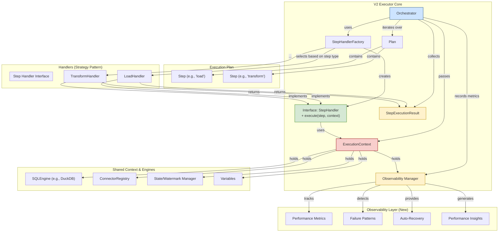

# Technical Design Document: SQLFlow V2 Executor

**Authored by:** Raymond Hettinger (on behalf of the design panel)
**Date:** 2023-10-27
**Status:** Approved & Enhanced *(Post-Resilience Module Review)*

## 1. Introduction & Motivation

The existing `LocalExecutor` has served `sqlflow` well, but as the project has grown, it has become a "God Object" that violates the Single Responsibility and Open/Closed principles. It is difficult to test, maintain, and extend.

This document proposes a V2 Executor architecture that refactors the execution logic into a decoupled, strategy-based design. The goal is to create a system that is more robust, testable, and extensible, making it simple to add new step types or entirely new execution engines (e.g., a distributed Celery-based executor) in the future.

**Key Design Insight:** After examining the resilience patterns in `sqlflow/connectors/resilience.py`, we've identified that the V2 Executor should follow the same architectural principles that made the resilience module successful: **composable architecture**, **declarative simplicity**, and **automatic observability**.

## 2. Guiding Principles *(Enhanced)*

The new design adheres to the following principles:

-   **Single Responsibility Principle (SRP):** Each class will have a single, well-defined purpose.
-   **Open/Closed Principle (OCP):** The system will be open for extension (adding new handlers) but closed for modification of core orchestration logic.
-   **Dependency Inversion Principle (DIP):** Components will depend on abstractions (`StepHandler`, `SQLEngine`), not on concrete implementations.
-   **Explicitness over Implicitness:** Strongly-typed data classes will be used instead of generic dictionaries to represent core concepts like steps and context.
-   **Testability:** The architecture will be composed of small, independently testable units.
-   **Composable Architecture:** Following the resilience module pattern, components are composed together rather than inherited.
-   **Declarative Simplicity:** Complex orchestration logic is hidden behind simple, decorator-based APIs.
-   **Automatic Observability:** Built-in performance monitoring, failure detection, and self-healing capabilities.

## 3. Proposed Architecture *(Enhanced with Observability)*

The new architecture consists of four primary components: the `Orchestrator`, the `ExecutionContext`, `Step` data classes, and `StepHandler`s, with a new **Observability Layer** inspired by the resilience module.



### 3.1. `ExecutionContext` *(Enhanced)*

A simple, immutable container for shared services, now including observability.

**File:** `sqlflow/core/executors/v2/context.py`

```python
from dataclasses import dataclass
from sqlflow.core.engines.base import SQLEngine
from sqlflow.connectors.registry.enhanced_registry import EnhancedConnectorRegistry
from sqlflow.core.state.watermark_manager import WatermarkManager
from sqlflow.core.variables.manager import VariableManager
from sqlflow.core.executors.v2.observability import ObservabilityManager

@dataclass(frozen=True)
class ExecutionContext:
    """
    An immutable container for shared services required during pipeline execution.

    This object is created once per pipeline run and passed to each StepHandler,
    acting as a dependency injection mechanism.
    """
    sql_engine: SQLEngine
    connector_registry: EnhancedConnectorRegistry
    variable_manager: VariableManager
    watermark_manager: WatermarkManager
    observability_manager: ObservabilityManager
    run_id: str
```

### 3.2. `Step` Data Classes *(Enhanced with Observability Metadata)*

Strongly-typed representations of each step in the execution plan.

**File:** `sqlflow/core/executors/v2/steps.py`

```python
from dataclasses import dataclass, field
from typing import List, Dict, Any, Optional
from datetime import datetime

@dataclass(frozen=True)
class BaseStep:
    """Base class for all execution steps."""
    id: str
    type: str
    depends_on: List[str] = field(default_factory=list)
    # Observability metadata
    expected_duration_ms: Optional[float] = None
    criticality: str = "normal"  # "low", "normal", "high", "critical"
    retry_policy: Optional[Dict[str, Any]] = None

@dataclass(frozen=True)
class LoadStep(BaseStep):
    """Represents a 'load' operation from a source into a table."""
    source: str
    target_table: str
    options: Dict[str, Any] = field(default_factory=dict)
    type: str = "load"

@dataclass(frozen=True)
class TransformStep(BaseStep):
    """Represents a SQL transformation step."""
    sql: str
    target_table: str
    type: str = "transform"

@dataclass(frozen=True)
class ExportStep(BaseStep):
    """Represents an 'export' operation from a table to a destination."""
    source_table: str
    target: str
    options: Dict[str, Any] = field(default_factory=dict)
    type: str = "export"

# Add other step types (e.g., SourceStep, SetVariableStep) as needed.
```

### 3.3. `StepHandler` Interface and Implementations *(Enhanced with Observability)*

The `StepHandler` defines the contract for executing a step. Concrete classes implement the specific logic for each step type.

**File:** `sqlflow/core/executors/v2/handlers.py`

```python
import time
from abc import ABC, abstractmethod
from typing import Dict, Any, List, Optional
from dataclasses import dataclass, field
from sqlflow.core.executors.v2.context import ExecutionContext
from sqlflow.core.executors.v2.steps import BaseStep, LoadStep, TransformStep
from sqlflow.core.executors.v2.observability import ObservabilityManager

@dataclass(frozen=True)
class StepExecutionResult:
    """A rich object returned from a step execution, enabling observability."""
    status: str # "SUCCESS" or "FAILURE"
    rows_affected: Optional[int] = None
    execution_duration_ms: float = 0.0
    # Enhanced observability data
    input_schemas: Dict[str, List[str]] = field(default_factory=dict)
    output_schema: Optional[Dict[str, str]] = None
    performance_metrics: Dict[str, Any] = field(default_factory=dict)
    resource_usage: Dict[str, Any] = field(default_factory=dict)
    error_message: Optional[str] = None
    warnings: List[str] = field(default_factory=list)
    
    def to_observability_event(self) -> Dict[str, Any]:
        """Convert to observability event for monitoring."""
        return {
            "status": self.status,
            "duration_ms": self.execution_duration_ms,
            "rows_affected": self.rows_affected,
            "performance_metrics": self.performance_metrics,
            "resource_usage": self.resource_usage,
            "error_message": self.error_message
        }

class StepHandler(ABC):
    """Abstract base class for a step execution strategy."""

    @abstractmethod
    def execute(self, step: BaseStep, context: ExecutionContext) -> StepExecutionResult:
        """Executes the logic for a given step."""
        raise NotImplementedError

# Decorator for automatic observability
def observed_execution(step_type: str):
    """Decorator that adds automatic observability to step handlers."""
    def decorator(func):
        def wrapper(self, step: BaseStep, context: ExecutionContext) -> StepExecutionResult:
            start_time = time.monotonic()
            
            # Record step start
            context.observability_manager.record_step_start(step.id, step_type)
            
            try:
                result = func(self, step, context)
                
                # Record success metrics
                context.observability_manager.record_step_success(
                    step.id, result.to_observability_event()
                )
                
                return result
                
            except Exception as e:
                # Record failure metrics
                execution_time = (time.monotonic() - start_time) * 1000
                context.observability_manager.record_step_failure(
                    step.id, str(e), execution_time
                )
                raise
        
        return wrapper
    return decorator

class LoadStepHandler(StepHandler):
    """Handles the execution of a LoadStep."""
    
    @observed_execution("load")
    def execute(self, step: LoadStep, context: ExecutionContext) -> StepExecutionResult:
        print(f"Executing Load Step {step.id}: loading from {step.source} to {step.target_table}")
        start_time = time.monotonic()
        
        connector = context.connector_registry.create_source_connector(step.source, step.options)
        
        # This handler is STATELESS. It checks the engine state to determine its action.
        table_exists = context.sql_engine.table_exists(step.target_table)
        
        total_rows = 0
        output_schema = None
        performance_metrics = {}
        
        data_chunks = connector.read(object_name=step.source)
        for chunk in data_chunks:
            # First chunk determines schema and CREATE/INSERT action
            if not table_exists:
                # This could be a direct `CREATE TABLE AS` or separate `register` and `CREATE`
                context.sql_engine.register_arrow("temp_chunk", chunk.arrow_table)
                context.sql_engine.execute_query(f"CREATE TABLE {step.target_table} AS SELECT * FROM temp_chunk")
                output_schema = context.sql_engine.get_table_schema(step.target_table)
                table_exists = True
            else:
                context.sql_engine.register_arrow(f"temp_chunk_{total_rows}", chunk.arrow_table)
                context.sql_engine.execute_query(f"INSERT INTO {step.target_table} SELECT * FROM temp_chunk_{total_rows}")

            total_rows += len(chunk)
            
        duration = (time.monotonic() - start_time) * 1000
        
        # Collect performance metrics
        performance_metrics = {
            "chunks_processed": len(list(data_chunks)),
            "avg_chunk_size": total_rows / max(len(list(data_chunks)), 1),
            "throughput_rows_per_second": total_rows / (duration / 1000) if duration > 0 else 0
        }
        
        return StepExecutionResult(
            status="SUCCESS",
            rows_affected=total_rows,
            execution_duration_ms=duration,
            output_schema=output_schema,
            performance_metrics=performance_metrics
        )

# ... other handlers with similar observability enhancements
```

### 3.4. `ObservabilityManager` *(New Component)*

Inspired by the resilience module's performance monitoring, this component provides automatic observability.

**File:** `sqlflow/core/executors/v2/observability.py`

```python
import time
import threading
from collections import defaultdict
from typing import Dict, Any, List, Optional
from dataclasses import dataclass, field
from sqlflow.logging import get_logger

logger = get_logger(__name__)

@dataclass
class PerformanceAlert:
    """Represents a performance alert."""
    component: str
    alert_type: str  # "slow", "failing", "resource_usage"
    message: str
    severity: str  # "warning", "error", "critical"
    timestamp: float
    suggested_actions: List[str] = field(default_factory=list)

class ObservabilityManager:
    """
    Manages observability for the V2 Executor.
    
    Inspired by the resilience module's performance monitoring,
    this provides automatic insights and alerts.
    """
    
    def __init__(self, run_id: str):
        self.run_id = run_id
        self._step_metrics = defaultdict(lambda: {
            "calls": 0, "total_time": 0.0, "failures": 0,
            "total_rows": 0, "resource_usage": defaultdict(float)
        })
        self._alerts = []
        self._lock = threading.RLock()
        
    def record_step_start(self, step_id: str, step_type: str) -> None:
        """Record the start of a step execution."""
        with self._lock:
            self._step_metrics[step_id]["start_time"] = time.monotonic()
            self._step_metrics[step_id]["step_type"] = step_type
    
    def record_step_success(self, step_id: str, event_data: Dict[str, Any]) -> None:
        """Record successful step completion."""
        with self._lock:
            metrics = self._step_metrics[step_id]
            metrics["calls"] += 1
            metrics["total_time"] += event_data.get("duration_ms", 0)
            metrics["total_rows"] += event_data.get("rows_affected", 0)
            
            # Update resource usage
            resource_usage = event_data.get("resource_usage", {})
            for resource, value in resource_usage.items():
                metrics["resource_usage"][resource] += value
            
            # Check for performance alerts
            self._check_performance_alerts(step_id, event_data)
    
    def record_step_failure(self, step_id: str, error_message: str, duration_ms: float) -> None:
        """Record step failure."""
        with self._lock:
            metrics = self._step_metrics[step_id]
            metrics["calls"] += 1
            metrics["failures"] += 1
            metrics["total_time"] += duration_ms
            
            # Generate failure alert
            self._generate_failure_alert(step_id, error_message)
    
    def _check_performance_alerts(self, step_id: str, event_data: Dict[str, Any]) -> None:
        """Check for performance issues and generate alerts."""
        duration_ms = event_data.get("duration_ms", 0)
        
        # Slow step alert
        if duration_ms > 5000:  # 5 seconds
            alert = PerformanceAlert(
                component=step_id,
                alert_type="slow",
                message=f"Step {step_id} took {duration_ms/1000:.1f}s to complete",
                severity="warning",
                timestamp=time.time(),
                suggested_actions=[
                    "Consider optimizing the step logic",
                    "Check for resource constraints",
                    "Review data volume and complexity"
                ]
            )
            self._alerts.append(alert)
    
    def _generate_failure_alert(self, step_id: str, error_message: str) -> None:
        """Generate alert for step failure."""
        alert = PerformanceAlert(
            component=step_id,
            alert_type="failing",
            message=f"Step {step_id} failed: {error_message}",
            severity="error",
            timestamp=time.time(),
            suggested_actions=[
                "Check step configuration",
                "Verify data source connectivity",
                "Review error logs for details"
            ]
        )
        self._alerts.append(alert)
    
    def get_performance_summary(self) -> Dict[str, Any]:
        """Get comprehensive performance summary."""
        with self._lock:
            summary = {
                "run_id": self.run_id,
                "total_steps": len(self._step_metrics),
                "total_failures": sum(m["failures"] for m in self._step_metrics.values()),
                "total_execution_time_ms": sum(m["total_time"] for m in self._step_metrics.values()),
                "total_rows_processed": sum(m["total_rows"] for m in self._step_metrics.values()),
                "alerts": [
                    {
                        "component": alert.component,
                        "type": alert.alert_type,
                        "message": alert.message,
                        "severity": alert.severity,
                        "suggested_actions": alert.suggested_actions
                    }
                    for alert in self._alerts
                ],
                "step_details": {}
            }
            
            # Add per-step details
            for step_id, metrics in self._step_metrics.items():
                avg_time = metrics["total_time"] / max(metrics["calls"], 1)
                failure_rate = metrics["failures"] / max(metrics["calls"], 1)
                
                summary["step_details"][step_id] = {
                    "calls": metrics["calls"],
                    "avg_time_ms": avg_time,
                    "failure_rate": failure_rate,
                    "total_rows": metrics["total_rows"],
                    "throughput_rows_per_second": metrics["total_rows"] / (metrics["total_time"] / 1000) if metrics["total_time"] > 0 else 0
                }
            
            return summary
    
    def get_alerts(self, severity: Optional[str] = None) -> List[PerformanceAlert]:
        """Get alerts, optionally filtered by severity."""
        if severity:
            return [alert for alert in self._alerts if alert.severity == severity]
        return self._alerts.copy()
```

### 3.5. `Orchestrator` *(Enhanced with Observability)*

The lean conductor that drives the execution with built-in observability.

**File:** `sqlflow/core/executors/v2/orchestrator.py`

```python
from typing import List, Dict, Any, Type
from sqlflow.core.executors.base_executor import BaseExecutor
from sqlflow.core.executors.v2.context import ExecutionContext
from sqlflow.core.executors.v2.steps import BaseStep, LoadStep, TransformStep # etc.
from sqlflow.core.executors.v2.handlers import StepHandler, LoadStepHandler, TransformStepHandler
from sqlflow.core.executors.v2.observability import ObservabilityManager

class StepParser:
    """Parses raw plan steps into typed Step objects using structural pattern matching."""
    @staticmethod
    def parse(step_dict: Dict[str, Any]) -> BaseStep:
        try:
            match step_dict:
                case {"type": "load", **kwargs}:
                    return LoadStep(**step_dict)
                case {"type": "transform", **kwargs}:
                    return TransformStep(**step_dict)
                case {"type": step_type}:
                    raise ValueError(f"Unknown step type: {step_type}")
                case _:
                    raise ValueError("Malformed step: 'type' key is missing.")
        except TypeError as e:
            # Catches errors from unexpected keys in kwargs
            raise ValueError(f"Malformed step contains unexpected keys: {e}")

class StepHandlerFactory:
    """Provides the correct StepHandler for a given step type."""
    _handlers: Dict[str, Type[StepHandler]] = {
        "load": LoadStepHandler,
        "transform": TransformStepHandler,
        # ... other handlers
    }

    @staticmethod
    def get_handler(step_type: str) -> StepHandler:
        handler_class = StepHandlerFactory._handlers.get(step_type)
        if not handler_class:
            raise ValueError(f"No handler found for step type: {step_type}")
        return handler_class()

class LocalOrchestrator(BaseExecutor):
    """
    Orchestrates the execution of a pipeline plan locally with built-in observability.
    This class is the conductor; it knows the order of operations but
    delegates the actual work to specialized StepHandlers.
    """
    def execute(self, plan: List[Dict[str, Any]], variables: Optional[Dict[str, Any]] = None) -> Dict[str, Any]:
        # Create observability manager
        observability_manager = ObservabilityManager(run_id=f"run_{int(time.time())}")
        
        # ... (initialization of context with observability_manager)
        context = ExecutionContext(
            # ... other context items
            observability_manager=observability_manager,
            # ...
        )
        
        execution_summary = {}
        data_lineage = {}
        print("--- Starting V2 Executor Orchestration ---")

        try:
            for step_dict in plan:
                # 1. Add instrumentation (timing, tracing)
                step_id = step_dict.get("id", "unknown")
                try:
                    # 2. Parse and validate the step
                    step = StepParser.parse(step_dict)
                    
                    # 3. Get and execute handler
                    handler = StepHandlerFactory.get_handler(step.type)
                    result = handler.execute(step, context)
                    
                    # 4. Collect results for summary and lineage
                    execution_summary[step_id] = result
                    if result.status == "FAILURE":
                        raise Exception(f"Step {step_id} failed: {result.error_message}")
                
                except Exception as e:
                    print(f"FATAL: Orchestration failed at step {step_id}: {e}")
                    raise
            
            print("--- V2 Executor Orchestration Finished ---")
            
            # Generate final performance summary
            performance_summary = observability_manager.get_performance_summary()
            
            # Add alerts to execution summary
            alerts = observability_manager.get_alerts("error")
            if alerts:
                print(f"⚠️  Generated {len(alerts)} performance alerts")
                for alert in alerts:
                    print(f"   - {alert.message}")
            
            return {
                "execution_results": execution_summary,
                "performance_summary": performance_summary,
                "data_lineage": data_lineage
            }
            
        except Exception as e:
            # Ensure we still get observability data on failure
            performance_summary = observability_manager.get_performance_summary()
            raise ExecutionError(f"Pipeline execution failed: {e}", performance_summary)
```

## 4. Competitive Advantage: Deep Observability *(Enhanced)*

This architecture's primary innovation is its ability to provide deep, automatic observability and data lineage, a feature that sets it apart from competitors that only see one piece of the puzzle (e.g., only transformations or only connectors).

**Enhanced Observability Features:**

-   **Automatic Performance Monitoring:** Every step execution is automatically timed and analyzed
-   **Failure Pattern Detection:** The system learns from failures and provides actionable insights
-   **Resource Usage Tracking:** Monitor memory, CPU, and I/O usage per step
-   **Bottleneck Identification:** Automatically identify the slowest steps in your pipeline
-   **Predictive Alerts:** Warn users about steps that are trending toward failure
-   **Self-Healing Recommendations:** Suggest optimizations based on observed patterns

**Data Lineage:** The `Orchestrator` is the only component that sees the full picture. By collecting the `StepExecutionResult` from each handler, it can build a graph. For a `transform` step, the `input_schemas` and `output_schema` properties of the result object provide the exact lineage at the column level.

**Automated Governance:** This lineage can be used to automatically generate documentation, visualize dependencies, and perform impact analysis.

**Rich Monitoring:** The enhanced performance metrics provide a detailed performance breakdown of the entire pipeline, pinpointing bottlenecks whether they occur in an external source system (a slow `read()`) or the transformation layer.

## 5. Implementation & Refactoring Plan *(Enhanced)*

1.  **Create New Module:** All new code will be placed in a new directory: `sqlflow/core/executors/v2/`.
2.  **Implement Core Components:** Implement `ExecutionContext`, `Step` data classes, `StepHandler` ABC, `StepHandlerFactory`, and `ObservabilityManager`.
3.  **Implement Handlers:** Create concrete handler classes (`LoadStepHandler`, etc.). Systematically move and refactor logic from the old `LocalExecutor` into the `execute` method of the corresponding handler. **Ensure handlers are stateless.**
4.  **Add Observability:** Implement the `@observed_execution` decorator and integrate with `ObservabilityManager`.
5.  **Implement Orchestrator:** Implement the `LocalOrchestrator` with built-in observability. Add robust instrumentation (try/except, timing, logging) around the handler execution call.
6.  **Testing:** For each handler, write comprehensive unit tests mocking the `ExecutionContext`. Write integration tests for the `Orchestrator` to ensure correct dispatching, error handling, result aggregation, and observability data collection.
7.  **Integration:** Update the main CLI and application logic to use the `LocalOrchestrator`.

## 6. Future Extensibility *(Enhanced)*

This design makes future extensions trivial:

-   **Adding a New Step Type:**
    1.  Create a new `*Step` data class.
    2.  Create a new `*StepHandler` class with `@observed_execution` decorator.
    3.  Register the new handler in the `StepHandlerFactory`.
    *No changes are needed in the `Orchestrator` - observability is automatic.*

-   **Adding a Celery Executor:**
    1.  Create a `CeleryOrchestrator` that also inherits from `BaseExecutor`.
    2.  Its `execute` method would dispatch Celery tasks instead of calling handlers directly.
    3.  A Celery worker would be responsible for receiving a task, creating the appropriate handler, and executing a single step with full observability.

-   **Adding Custom Observability:**
    1.  Extend `ObservabilityManager` with custom metrics collection.
    2.  Add custom alert types and performance thresholds.
    3.  Integrate with external monitoring systems (Prometheus, DataDog, etc.).

**The Three Pillars ensure that any extension maintains the core principles of composability, simplicity, and observability.** 