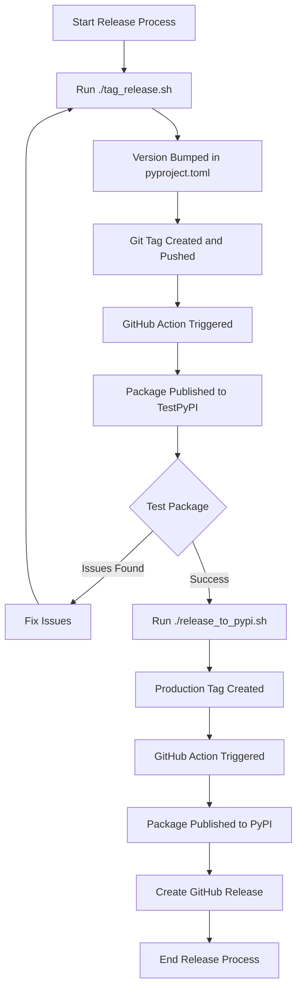

# SQLFlow Release Process Flowchart

## Process Steps

1. **Developer initiates release** by running `./tag_release.sh`
2. **Version is bumped** in pyproject.toml
3. **Git tag is created** and pushed to GitHub
4. **GitHub Action is triggered** by the tag
5. **Package is published** to TestPyPI
6. **Testing is performed** on the TestPyPI package
7. If issues are found, they are fixed and process restarts
8. If testing is successful, **promotion is initiated** with `./release_to_pypi.sh`
9. **Production tag is created** and pushed to GitHub
10. **GitHub Action is triggered** by the production tag
11. **Package is published** to PyPI
12. **GitHub Release is created** with release notes
13. **Release process is complete**
