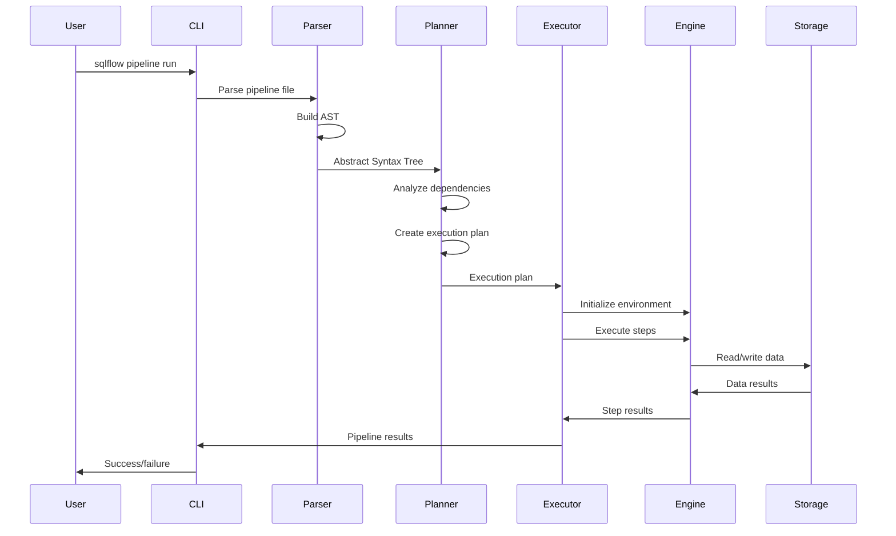
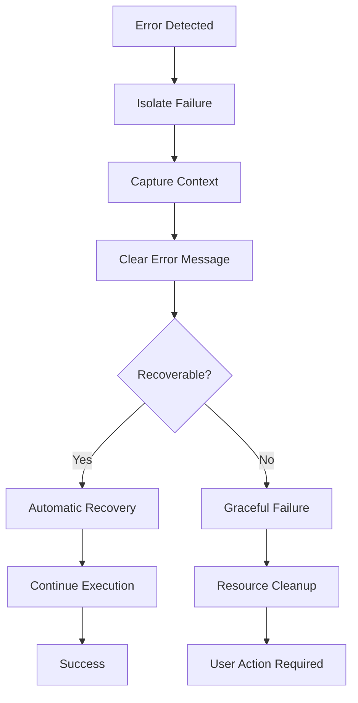
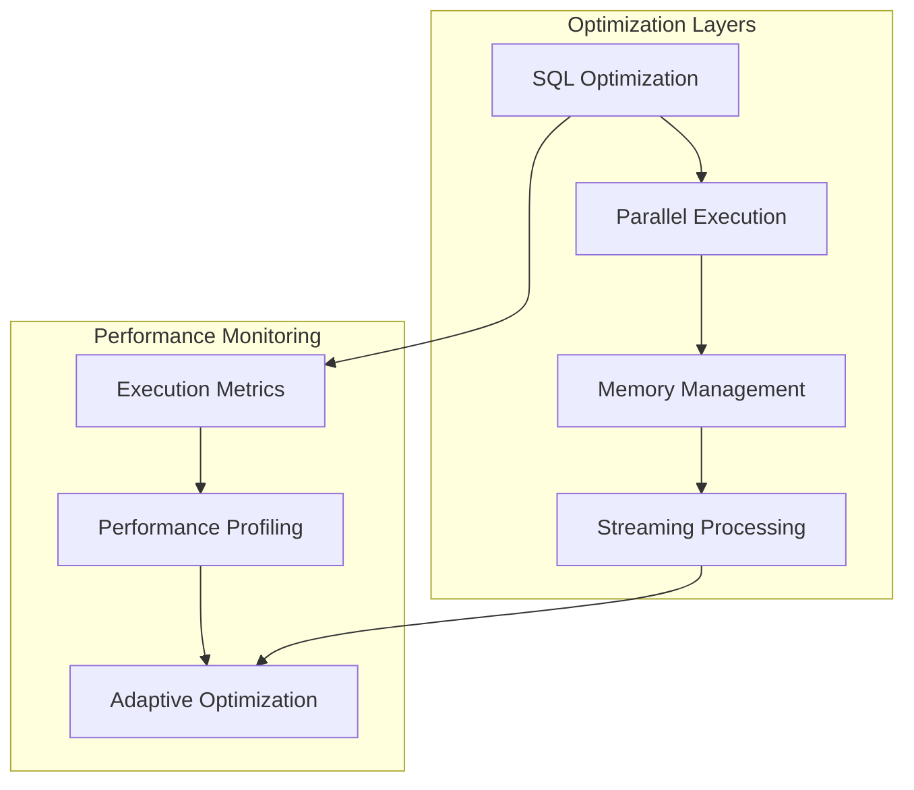
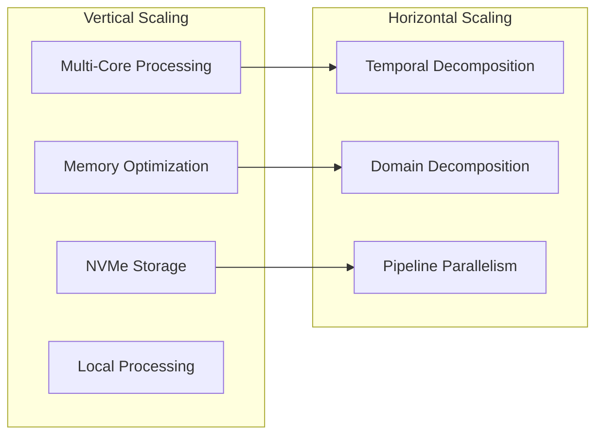
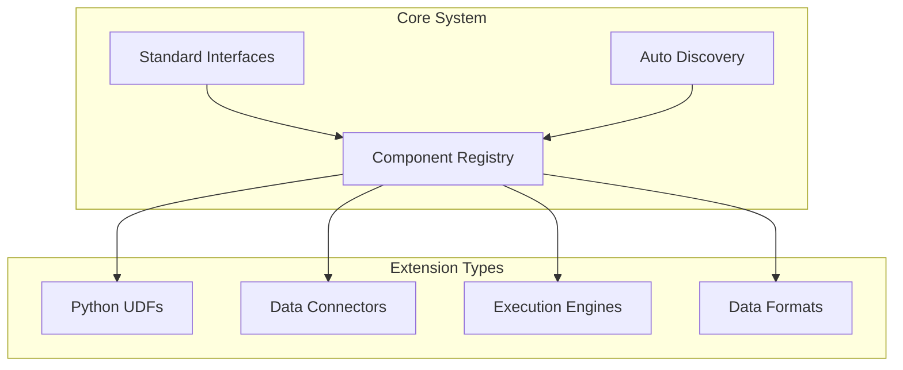

# SQLFlow Architecture Deep Dive

## Introduction

This document provides detailed implementation specifics, performance characteristics, and operational patterns for SQLFlow's architecture. For high-level system philosophy and design principles, see [Architecture Overview](architecture-overview.md).

## Implementation Details

## Data Flow Architecture

### Request Lifecycle



### Error Handling Philosophy

**Principle**: Fail fast, fail clearly, recover gracefully.



**Error Categories**:
1. **Syntax Errors**: Clear parsing messages with line numbers
2. **Dependency Errors**: Cycle detection and resolution suggestions
3. **Runtime Errors**: Context-aware error messages with recovery options
4. **Resource Errors**: Automatic retry with backoff strategies

## Performance Architecture

### Execution Strategy

**Philosophy**: Optimize for the common case, handle edge cases gracefully.



**Optimization Strategies**:
- **DuckDB Columnar**: Vectorized operations for analytical workloads
- **Parallel Execution**: Multi-core utilization for independent operations
- **Memory Management**: Intelligent spilling for larger-than-memory datasets
- **Connection Pooling**: Efficient resource reuse across operations

### Scalability Model

**Vertical First**: Optimize single-machine performance before distributed complexity.



**Rationale**:
- 80% of analytical workloads fit on single machines
- Vertical scaling eliminates network overhead
- Simpler debugging and operations
- Lower total cost of ownership

## Extension Architecture

### Plugin System Design

**Philosophy**: Extensions should enhance, never complicate.



**Extension Principles**:
1. **Auto-discovery**: Extensions register themselves
2. **Standard interfaces**: Consistent patterns across extension types
3. **Graceful degradation**: Missing extensions don't break core functionality
4. **Isolated execution**: Extension failures don't crash the system

## Future Architecture Vision

### Extensible Ecosystem

**Vision**: SQLFlow becomes a platform for data pipeline innovation.

```sql
-- Community-driven function ecosystem
PYTHON_UDFS FROM "ml-preprocessing>=2.0";
PYTHON_UDFS FROM "finance-analytics>=1.5";

-- Industry-specific connectors
SOURCE customer_data FROM salesforce;
SOURCE financial_data FROM bloomberg;

-- Intelligent optimization
-- System automatically chooses optimal execution strategy
SELECT customer_id, predict_churn(features)
FROM large_customer_dataset;  -- Auto-detected: streaming processing
```

**Technical Foundation**:
- Plugin architecture already supports extensibility
- Registry patterns enable package management
- Performance monitoring enables intelligent optimization
- Clean interfaces support multiple execution engines

### Multi-Engine Future

**Vision**: Support multiple execution engines while preserving SQL simplicity.

```yaml
# Environment-specific engine selection
profiles:
  development:
    engine: duckdb-memory
    
  production:
    engine: duckdb-persistent
    storage: nvme-optimized
    
  distributed:
    engine: spark-cluster
    cluster: production-hadoop
```

**Benefits**:
- Start simple, scale when needed
- SQL interface remains consistent
- Existing pipelines work across engines
- Performance optimization without rewriting

## Summary

SQLFlow's architecture achieves its goal of democratizing data pipeline development through principled design decisions:

**For Data Analysts**: SQL they know, enhanced with Python power when needed
**For Data Engineers**: Production-ready infrastructure without operational complexity
**For Organizations**: Faster insights with lower total cost of ownership

The architecture's success comes from relentless focus on the user experience while maintaining the technical rigor needed for production data systems. Every component asks: "Does this make data analysis more accessible?" The answer shapes every interface, every optimization, and every extension point.

---

**Related Architecture Documents**:
- [Architecture Overview](architecture-overview.md) - High-level system philosophy and design principles
- [UDF System Architecture](udf-system.md) - Python function integration and table UDF workarounds
- [Extending SQLFlow](extending-sqlflow.md) - Practical guide to building connectors and UDFs
- [Technical Overview](technical-overview.md) - Founder's vision and why SQLFlow exists 