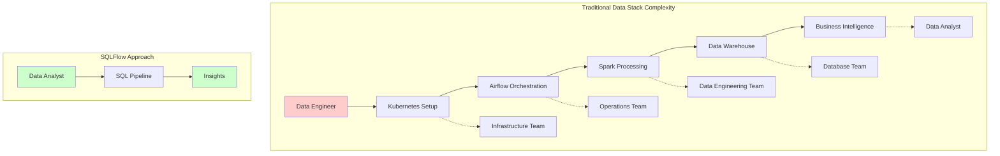
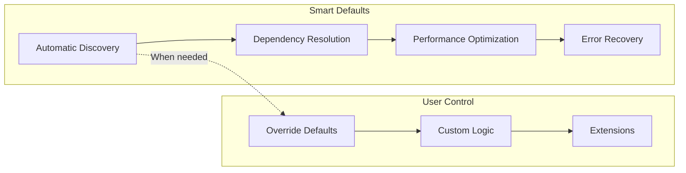
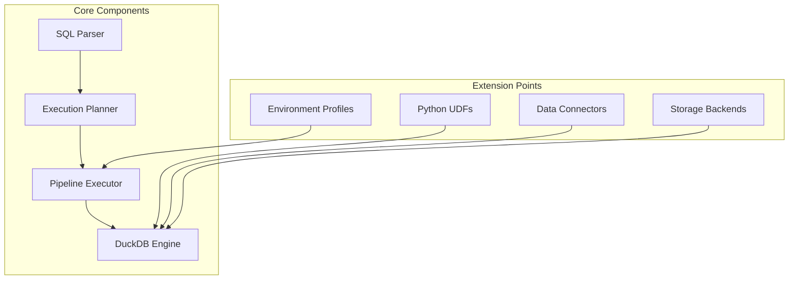
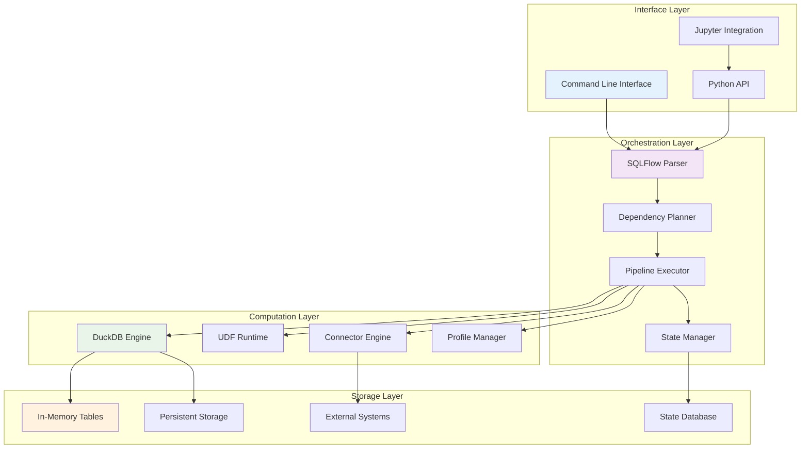
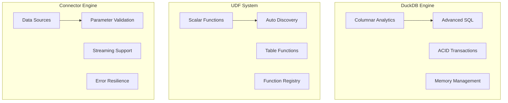
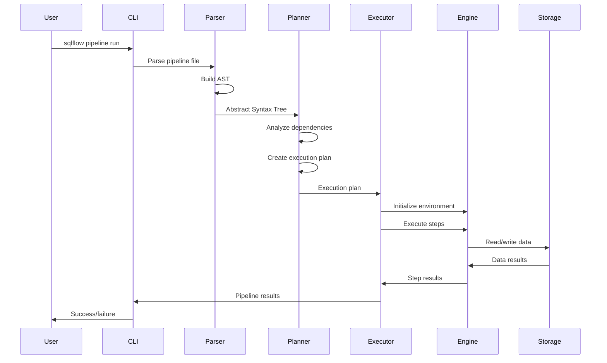
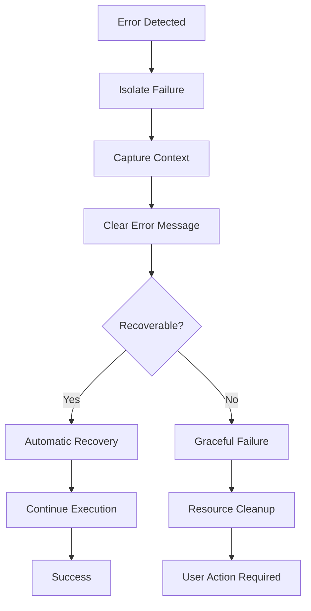
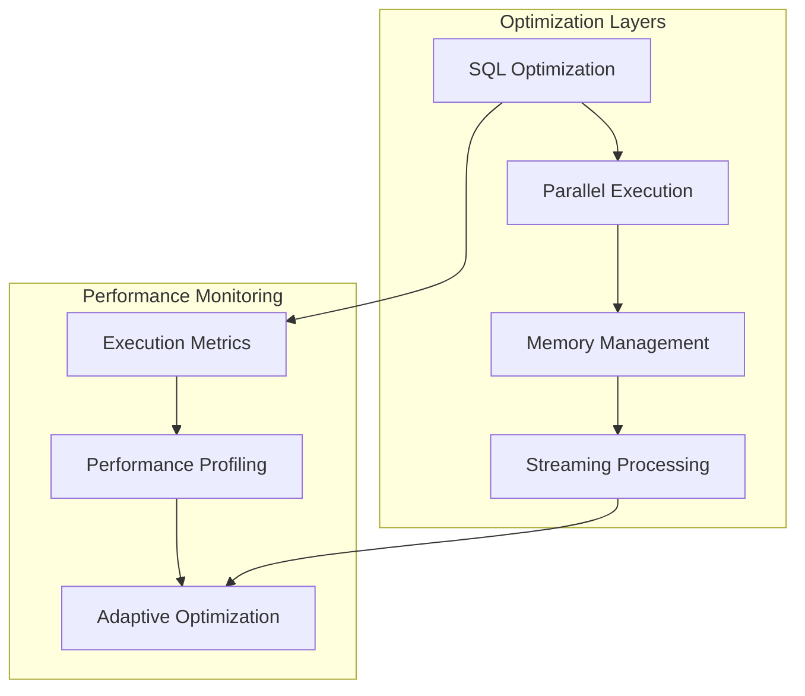
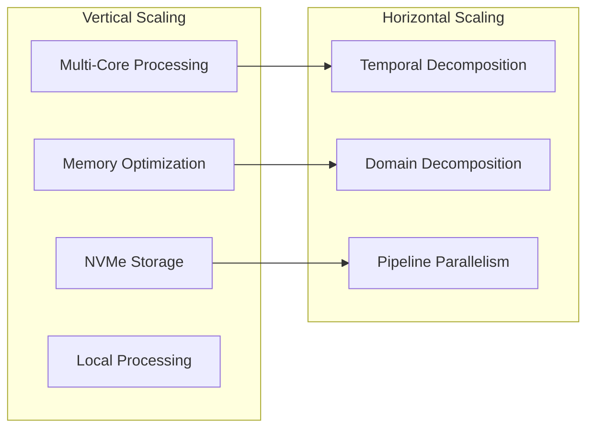
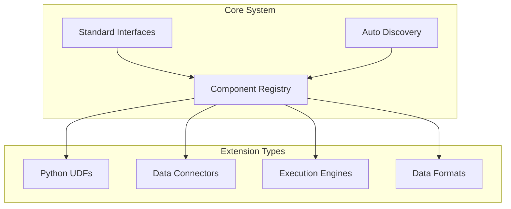

# SQLFlow Architecture Deep Dive

## System Philosophy and Design

SQLFlow's architecture embodies a fundamental belief: **sophisticated data pipelines shouldn't require sophisticated infrastructure**. Every architectural decision stems from the real-world experience of managing thousands of data pipelines at App Annie, where complexity was the enemy of productivity.

### The Problem SQLFlow Solves



**Traditional Stack Problems**:
- Multiple teams needed for single pipeline
- Infrastructure complexity before business logic
- Tool fragmentation and context switching
- Long feedback loops between idea and insight

**SQLFlow Solution**:
- Single analyst can build complete pipelines
- Zero infrastructure management
- SQL-native with Python extensions
- Immediate feedback and iteration

## Architectural Principles

### 1. Embedded Intelligence

**Principle**: The system should be smarter, not the user.



**Implementation**:
- Automatic UDF discovery and registration
- Dependency-driven execution planning
- Intelligent memory management and spilling
- Built-in state management and recovery

### 2. Progressive Complexity

**Principle**: Start simple, add power when needed.

```sql
-- Level 1: Basic SQL transformation
CREATE TABLE customer_metrics AS
SELECT customer_id, COUNT(*) as orders
FROM sales GROUP BY customer_id;

-- Level 2: Add custom calculations
SELECT customer_id, 
       calculate_ltv(revenue, churn_rate) as lifetime_value
FROM customers;

-- Level 3: Complex external processing
-- (Python preprocessing → SQL analytics → Python ML)
```

**Benefits**:
- Analysts start with familiar SQL
- Advanced features don't overwhelm beginners  
- Natural learning progression
- No ceiling on complexity

### 3. Composable Architecture

**Principle**: Every component should be independently useful and collectively powerful.



**Design Benefits**:
- Components can evolve independently
- Clear interfaces enable testing
- Extensions don't break core functionality
- Easy to reason about system behavior

## System Architecture Overview

### Four-Layer Architecture



### Interface Layer: Human-Centered Design

**Philosophy**: The interface should disappear, leaving only the intent.

**Command Line Interface**:
```bash
# Discoverable, self-documenting commands
sqlflow pipeline run customer-analysis
sqlflow udf list
sqlflow connector test postgres
```

**Python API**:
```python
# Pythonic integration for notebooks and scripts
from sqlflow import Pipeline

pipeline = Pipeline.from_file("customer-analysis.sf")
results = pipeline.run(profile="production")
```

**Design Priorities**:
- **Discoverability**: Help users find what they need
- **Consistency**: Same patterns across all interfaces
- **Feedback**: Clear progress and error messages
- **Integration**: Works with existing workflows

### Orchestration Layer: Intelligence Engine

**Philosophy**: Smart automation with human override capability.

**Key Components**:

1. **Parser**: Understands SQLFlow syntax and business intent
2. **Planner**: Resolves dependencies and creates execution strategy
3. **Executor**: Manages resources and coordinates execution
4. **State Manager**: Tracks progress and enables recovery

**Intelligence Features**:
- **Dependency Analysis**: Automatic detection from SQL references
- **Execution Optimization**: Parallel execution where possible
- **Resource Management**: Memory and connection pooling
- **Error Recovery**: Graceful handling and recovery patterns

### Computation Layer: Engine Abstraction

**Philosophy**: Leverage best-in-class tools while hiding their complexity.



**DuckDB Engine**: 
- Columnar processing for analytical workloads
- ACID compliance for data integrity
- Memory-efficient operations with spilling
- Advanced SQL features (window functions, CTEs, etc.)

**UDF System**:
- Seamless Python integration
- Automatic function discovery
- Type-safe execution
- Performance monitoring

**Connector Engine**:
- Unified interface to data sources
- Automatic parameter validation
- Built-in resilience patterns
- Streaming data support

### Storage Layer: Flexible Persistence

**Philosophy**: Match storage strategy to use case.

**Storage Modes**:

1. **Memory Mode**: Ultra-fast development and testing
2. **Persistent Mode**: Production reliability with ACID guarantees
3. **External Mode**: Integration with existing systems
4. **Hybrid Mode**: Optimal placement for different data types

**Design Benefits**:
- **Development Speed**: Instant feedback with memory mode
- **Production Ready**: Persistent mode for reliability
- **Integration**: Connect to existing data infrastructure
- **Flexibility**: Choose optimal storage per use case

## Data Flow Architecture

### Request Lifecycle



### Error Handling Philosophy

**Principle**: Fail fast, fail clearly, recover gracefully.



**Error Categories**:
1. **Syntax Errors**: Clear parsing messages with line numbers
2. **Dependency Errors**: Cycle detection and resolution suggestions
3. **Runtime Errors**: Context-aware error messages with recovery options
4. **Resource Errors**: Automatic retry with backoff strategies

## Performance Architecture

### Execution Strategy

**Philosophy**: Optimize for the common case, handle edge cases gracefully.



**Optimization Strategies**:
- **DuckDB Columnar**: Vectorized operations for analytical workloads
- **Parallel Execution**: Multi-core utilization for independent operations
- **Memory Management**: Intelligent spilling for larger-than-memory datasets
- **Connection Pooling**: Efficient resource reuse across operations

### Scalability Model

**Vertical First**: Optimize single-machine performance before distributed complexity.



**Rationale**:
- 80% of analytical workloads fit on single machines
- Vertical scaling eliminates network overhead
- Simpler debugging and operations
- Lower total cost of ownership

## Extension Architecture

### Plugin System Design

**Philosophy**: Extensions should enhance, never complicate.



**Extension Principles**:
1. **Auto-discovery**: Extensions register themselves
2. **Standard interfaces**: Consistent patterns across extension types
3. **Graceful degradation**: Missing extensions don't break core functionality
4. **Isolated execution**: Extension failures don't crash the system

## Future Architecture Vision

### Extensible Ecosystem

**Vision**: SQLFlow becomes a platform for data pipeline innovation.

```sql
-- Community-driven function ecosystem
PYTHON_UDFS FROM "ml-preprocessing>=2.0";
PYTHON_UDFS FROM "finance-analytics>=1.5";

-- Industry-specific connectors
SOURCE customer_data FROM salesforce;
SOURCE financial_data FROM bloomberg;

-- Intelligent optimization
-- System automatically chooses optimal execution strategy
SELECT customer_id, predict_churn(features)
FROM large_customer_dataset;  -- Auto-detected: streaming processing
```

**Technical Foundation**:
- Plugin architecture already supports extensibility
- Registry patterns enable package management
- Performance monitoring enables intelligent optimization
- Clean interfaces support multiple execution engines

### Multi-Engine Future

**Vision**: Support multiple execution engines while preserving SQL simplicity.

```yaml
# Environment-specific engine selection
profiles:
  development:
    engine: duckdb-memory
    
  production:
    engine: duckdb-persistent
    storage: nvme-optimized
    
  distributed:
    engine: spark-cluster
    cluster: production-hadoop
```

**Benefits**:
- Start simple, scale when needed
- SQL interface remains consistent
- Existing pipelines work across engines
- Performance optimization without rewriting

## Summary

SQLFlow's architecture achieves its goal of democratizing data pipeline development through principled design decisions:

**For Data Analysts**: SQL they know, enhanced with Python power when needed
**For Data Engineers**: Production-ready infrastructure without operational complexity
**For Organizations**: Faster insights with lower total cost of ownership

The architecture's success comes from relentless focus on the user experience while maintaining the technical rigor needed for production data systems. Every component asks: "Does this make data analysis more accessible?" The answer shapes every interface, every optimization, and every extension point.

---

**Detailed Component Architectures**:
- [Engine Layer Architecture](engine-layer.md) - DuckDB integration, storage, and transaction management
- [Processing Layer Architecture](processing-layer.md) - Parser, planner, and execution engine details  
- [UDF System Architecture](udf-system.md) - Python function integration and table UDF workarounds
- [Connector Architecture](connector-architecture.md) - Data source abstraction and registry patterns
- [State Management Architecture](state-management.md) - Pipeline state, watermarks, and recovery 