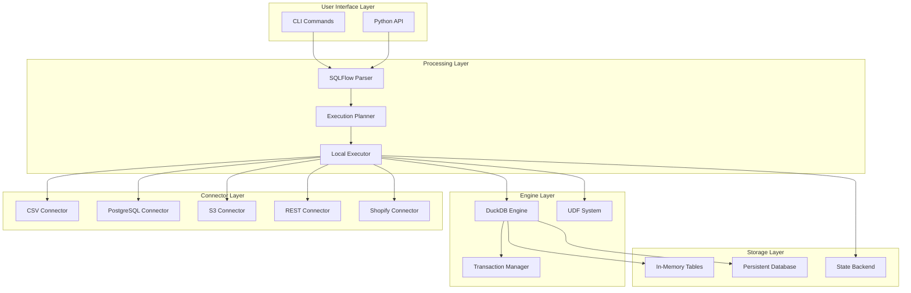

# SQLFlow Architecture Deep Dive

## Introduction

This document provides a comprehensive technical deep dive into SQLFlow's architecture, covering system design decisions, implementation details, and the technical rationale behind key components. This is essential reading for developers who want to understand how SQLFlow works internally and how to contribute to its development.

## System Architecture Overview

### Core Design Principles

SQLFlow's architecture is built around several key design principles:

1. **Embedded Execution**: No external infrastructure dependencies
2. **SQL-Native Processing**: SQL as the primary transformation language
3. **Modular Extensibility**: Clean interfaces for connectors and UDFs
4. **Dependency-Driven Execution**: Automatic dependency resolution and execution ordering
5. **ACID Compliance**: Reliable data processing with transaction guarantees

### High-Level Architecture



## Engine Layer: DuckDB Integration

### Why DuckDB?

The choice of DuckDB as SQLFlow's execution engine was driven by specific technical requirements. From `sqlflow/core/engines/duckdb/engine.py`:

```python
class DuckDBEngine(SQLEngine):
    def __init__(self, database_path: Optional[str] = None):
        """Initialize DuckDB engine with flexible storage options."""
        self.database_path = self._setup_database_path(database_path)
        self.is_persistent = self.database_path != DuckDBConstants.MEMORY_DATABASE
        
        # DuckDB provides seamless switching between memory and disk
        self.connection = duckdb.connect(database_path)
        self._configure_persistence()
```

**Technical advantages of DuckDB**:

1. **Columnar Storage & Vectorized Execution**: 10-100x faster analytical queries than row-based databases
2. **Embedded Architecture**: Zero configuration, no server management
3. **Hybrid OLTP/OLAP**: Supports both transactional operations and analytical queries
4. **Memory + Persistent Modes**: Seamless switching for development vs production
5. **Python Integration**: Native PyArrow and pandas support with zero-copy data transfer
6. **Modern SQL**: Full SQL standard compliance with advanced analytical functions

### Storage Mode Architecture

SQLFlow supports two storage modes through DuckDB configuration. From `sqlflow/core/engines/duckdb/constants.py`:

```python
class DuckDBConstants:
    MEMORY_DATABASE = ":memory:"
    DEFAULT_DATABASE_PATH = "target/default.db"
    DEFAULT_MEMORY_LIMIT = "2GB"
    
    SQL_CHECKPOINT = "CHECKPOINT"
    SQL_PRAGMA_MEMORY_LIMIT = "PRAGMA memory_limit='{memory_limit}'"
```

**Memory Mode (`:memory:`)**:
- **Use case**: Development, testing, rapid iteration
- **Performance**: 2-10x faster execution due to no disk I/O
- **Limitations**: Data lost when process ends
- **Memory management**: Configurable memory limits with automatic spilling

**Persistent Mode (file path)**:
- **Use case**: Production, data persistence, large datasets
- **Performance**: Comparable to PostgreSQL for analytical workloads
- **Durability**: ACID-compliant with automatic checkpointing
- **Scalability**: Handles datasets larger than available memory

### Transaction Management

SQLFlow implements robust transaction management for data reliability. From `sqlflow/core/engines/duckdb/transaction_manager.py`:

```python
class TransactionManager:
    def __enter__(self):
        """Begin transaction context."""
        logger.debug("Starting transaction")
        self.in_transaction = True
        return self
        
    def __exit__(self, exc_type, exc_val, exc_tb):
        """Complete transaction with proper error handling."""
        if exc_type is None:
            self.commit()
        else:
            self.rollback()
        self.in_transaction = False
```

**Transaction guarantees**:
- **Atomicity**: All operations in a transaction succeed or fail together
- **Consistency**: Database remains in valid state after transactions
- **Isolation**: Concurrent transactions don't interfere with each other
- **Durability**: Committed data survives system failures

## Processing Layer: Parser, Planner, Executor

### SQLFlow Parser

The parser converts SQLFlow syntax into an Abstract Syntax Tree (AST):

```python
# From: sqlflow/parser/ast.py
class Pipeline:
    """Root AST node representing a complete SQLFlow pipeline."""
    def __init__(self, steps: List[PipelineStep]):
        self.steps = steps

class SQLBlockStep(PipelineStep):
    """Represents a SQL transformation step."""
    def __init__(self, table_name: str, sql_query: str):
        self.table_name = table_name
        self.sql_query = sql_query
```

**Key parser features**:
- **SQL-first syntax**: Minimal non-SQL constructs
- **Dependency inference**: Automatic detection of table dependencies
- **Variable substitution**: Support for `${variable}` expressions
- **Conditional logic**: `IF-THEN-ELSE` blocks for environment-specific logic

### Execution Planner

The planner converts the AST into a dependency-ordered execution plan. From `sqlflow/core/planner.py`:

```python
class ExecutionPlanBuilder:
    def build_plan(self, pipeline: Pipeline, variables: Dict[str, Any]) -> List[Dict[str, Any]]:
        """Build dependency-ordered execution plan."""
        # 1. Validate variable references
        self._validate_variable_references(pipeline, variables)
        
        # 2. Flatten conditional blocks based on variable values
        flattened_pipeline = self._flatten_conditional_blocks(pipeline, variables)
        
        # 3. Build dependency graph
        self._build_dependency_graph(flattened_pipeline)
        
        # 4. Detect and prevent cycles
        cycles = self._detect_cycles(resolver)
        if cycles:
            raise PlanningError(self._format_cycle_error(cycles))
            
        # 5. Resolve execution order
        execution_order = self._build_execution_order(resolver, entry_points)
        
        return self._build_execution_steps(flattened_pipeline, execution_order)
```

**Dependency resolution algorithm**:

1. **Table mapping**: Create mapping from table names to the steps that create them
2. **Reference analysis**: Parse SQL to find table references in `FROM`, `JOIN` clauses
3. **Dependency graph**: Build directed graph of step dependencies
4. **Cycle detection**: Use depth-first search to detect circular dependencies
5. **Topological sort**: Resolve execution order that respects all dependencies

**Example dependency resolution**:
```sql
-- SQLFlow pipeline
SOURCE users FROM postgres PARAMS { "table": "users" };
LOAD user_data FROM users;

CREATE TABLE user_metrics AS
SELECT user_id, COUNT(*) as event_count
FROM user_data
GROUP BY user_id;

EXPORT user_metrics TO csv PARAMS { "path": "output/metrics.csv" };
```

**Resolved execution order**:
1. `SOURCE users` (no dependencies)
2. `LOAD user_data` (depends on `users` source)  
3. `CREATE TABLE user_metrics` (depends on `user_data` table)
4. `EXPORT user_metrics` (depends on `user_metrics` table)

### Local Executor

The executor runs the execution plan with support for state management and resumption. From `sqlflow/core/executors/local_executor.py`:

```python
class LocalExecutor(BaseExecutor):
    def __init__(self, profile: Optional[Dict[str, Any]] = None):
        """Initialize executor with DuckDB engine and state management."""
        self.engine = DuckDBEngine(database_path)
        self.state_backend = DuckDBStateBackend()
        self.watermark_manager = WatermarkManager(self.state_backend)
        
    def execute_plan(self, plan: List[Dict[str, Any]]) -> None:
        """Execute plan with dependency resolution and state tracking."""
        for step in plan:
            if self._should_skip_step(step):
                continue
            self._execute_step(step)
            self._update_step_state(step, TaskState.COMPLETED)
```

**Execution features**:
- **Incremental execution**: Skip completed steps on pipeline re-runs
- **Error recovery**: Resume from last successful step after failures
- **State persistence**: Track step completion in DuckDB state backend
- **Watermark management**: Handle incremental data processing with timestamps

## UDF System Architecture

### UDF Type System

SQLFlow supports two types of User-Defined Functions. From `sqlflow/udfs/decorators.py`:

```python
@python_scalar_udf
def calculate_ltv(revenue: float, months: int) -> float:
    """Scalar UDF - processes individual values."""
    return revenue * months * 0.85

@python_table_udf  
def cohort_analysis(df: pd.DataFrame) -> pd.DataFrame:
    """Table UDF - processes entire datasets."""
    return df.groupby('cohort').agg({
        'revenue': 'sum',
        'users': 'count'
    })
```

### UDF Registration and Execution

The UDF system automatically discovers and registers Python functions. From `sqlflow/core/engines/duckdb/engine.py`:

```python
def register_python_udf(self, name: str, function: Callable) -> None:
    """Register UDF with DuckDB engine."""
    flat_name = name.split(".")[-1]
    
    try:
        udf_handler = UDFHandlerFactory.create(function)
        udf_handler.register(flat_name, function, self.connection)
        self.registered_udfs[flat_name] = function
        
        # Special handling for table UDFs
        if hasattr(function, "_udf_type") and function._udf_type == "table":
            # Custom registry for table functions due to DuckDB API limitations
            if not hasattr(self.connection, "_sqlflow_table_functions"):
                self.connection._sqlflow_table_functions = {}
            self.connection._sqlflow_table_functions[flat_name] = function
            
    except Exception as e:
        raise UDFRegistrationError(f"Error registering UDF {flat_name}: {e}") from e
```

**UDF execution flow**:
1. **Discovery**: Scan Python modules for decorated functions
2. **Registration**: Register functions with DuckDB engine
3. **Type checking**: Validate function signatures and parameter types
4. **Execution**: Call functions during SQL query execution
5. **Error isolation**: UDF failures don't crash the entire pipeline

### Performance Optimization

SQLFlow includes several UDF performance optimizations:

```python
# From: sqlflow/core/engines/duckdb/engine.py
class UDFExecutionContext:
    """Context manager for UDF execution with performance tracking."""
    def __enter__(self):
        self.start_time = time.time()
        return self
        
    def __exit__(self, exc_type, exc_val, exc_tb):
        duration = time.time() - self.start_time
        if exc_type is None:
            self.logger.debug(f"UDF {self.udf_name} completed in {duration:.3f}s")
        else:
            self.logger.error(f"UDF {self.udf_name} failed after {duration:.3f}s")
```

**Performance features**:
- **Vectorized operations**: Leverage pandas/NumPy for bulk operations
- **Memory management**: Automatic garbage collection and memory monitoring  
- **Batch processing**: Process multiple DataFrames in single UDF calls
- **Arrow integration**: Zero-copy data transfer between SQL and Python

## Connector Architecture

### Connector Interface

All SQLFlow connectors implement a standardized interface:

```python
# From: sqlflow/connectors/base.py
from abc import ABC, abstractmethod
from typing import Any, Dict

class Connector(ABC):
    @abstractmethod
    def read(self) -> DataChunk:
        """Read data from the source."""
        pass
        
    @abstractmethod
    def validate_params(self, params: Dict[str, Any]) -> None:
        """Validate connector parameters."""
        pass
```

### Connector Registry System

SQLFlow uses a dynamic registry for connector discovery. From `sqlflow/connectors/__init__.py`:

```python
from sqlflow.connectors.registry import (
    CONNECTOR_REGISTRY,
    EXPORT_CONNECTOR_REGISTRY, 
    BIDIRECTIONAL_CONNECTOR_REGISTRY
)

# Connectors are automatically registered when modules are imported
try:
    from sqlflow.connectors import postgres_connector
    from sqlflow.connectors import csv_connector
    from sqlflow.connectors import s3_connector
except ImportError:
    # Graceful handling of missing dependencies
    pass
```

**Registry categories**:
- **Input connectors**: Read data from external sources
- **Export connectors**: Write data to external destinations  
- **Bidirectional connectors**: Support both reading and writing

### Built-in Connector Implementation

**CSV Connector Example**:
```python
class CSVConnector(Connector):
    def read(self) -> DataChunk:
        """Read CSV file with automatic schema inference."""
        df = pd.read_csv(
            self.params["path"],
            **self._build_pandas_options()
        )
        return DataChunk(data=df, metadata=self._extract_metadata(df))
        
    def validate_params(self, params: Dict[str, Any]) -> None:
        """Validate CSV-specific parameters."""
        required_params = ["path"]
        for param in required_params:
            if param not in params:
                raise ConnectorError(f"Missing required parameter: {param}")
```

**PostgreSQL Connector Features**:
- **Connection pooling**: Reuse database connections across operations
- **Schema inference**: Automatic detection of column types and constraints
- **Batch operations**: Efficient bulk inserts and updates
- **Error handling**: Comprehensive PostgreSQL error translation

## State Management and Persistence

### State Backend Architecture

SQLFlow uses DuckDB itself as the state backend for execution state:

```python
# From: sqlflow/core/state/backends.py
class DuckDBStateBackend:
    def __init__(self, db_path: Optional[str] = None):
        """Initialize state backend with dedicated DuckDB instance."""
        if db_path is None:
            # Default to user's home directory
            home_dir = os.path.expanduser("~")
            sqlflow_dir = os.path.join(home_dir, ".sqlflow")
            os.makedirs(sqlflow_dir, exist_ok=True)
            db_path = os.path.join(sqlflow_dir, "state.db")
            
        self.db_path = db_path
        self.conn = duckdb.connect(db_path)
        self._initialize_tables()
        
    def _initialize_tables(self):
        """Create state management tables."""
        self.conn.execute("""
            CREATE TABLE IF NOT EXISTS task_status (
                task_id TEXT PRIMARY KEY,
                status TEXT NOT NULL,
                started_at TIMESTAMP,
                completed_at TIMESTAMP,
                error_message TEXT
            )
        """)
```

### Watermark Management

For incremental data processing, SQLFlow implements watermark management:

```python
# From: sqlflow/core/state/watermark_manager.py
class WatermarkManager:
    def get_watermark(self, pipeline_name: str, step_name: str) -> Optional[Any]:
        """Get the last processed watermark value."""
        result = self.state_backend.get_watermark(pipeline_name, step_name)
        return result.value if result else None
        
    def update_watermark(self, pipeline_name: str, step_name: str, value: Any) -> None:
        """Update watermark after successful processing."""
        self.state_backend.save_watermark(pipeline_name, step_name, value)
```

**Watermark use cases**:
- **Incremental ETL**: Process only new/changed records since last run
- **Time-based processing**: Handle event streams with timestamps
- **Change data capture**: Track last processed change sequence numbers

## Performance Architecture

### Execution Statistics

SQLFlow tracks detailed performance metrics. From `sqlflow/core/engines/duckdb/engine.py`:

```python
class ExecutionStats:
    def __init__(self):
        """Initialize performance tracking."""
        self.query_count = 0
        self.udf_executions = 0
        self.udf_errors = 0
        self.query_times = []
        
    def record_query(self, duration: float):
        """Track query execution time."""
        self.query_count += 1
        self.query_times.append(duration)
        
    def get_avg_query_time(self) -> float:
        """Calculate average query execution time."""
        return sum(self.query_times) / len(self.query_times) if self.query_times else 0.0
```

### Memory Management

DuckDB provides configurable memory management:

```python
# Memory limit configuration in profiles
engines:
  duckdb:
    mode: persistent
    path: "data/sqlflow.duckdb"
    memory_limit: "4GB"  # Configurable memory ceiling
```

**Memory optimization strategies**:
- **Automatic spilling**: Large operations spill to disk when memory is limited
- **Columnar compression**: Efficient storage of analytical data
- **Lazy evaluation**: Load data only when needed for operations
- **Garbage collection**: Automatic cleanup of temporary objects

## Error Handling and Debugging

### Error Categories

SQLFlow implements comprehensive error handling across multiple layers:

1. **Parsing errors**: Invalid SQLFlow syntax
2. **Planning errors**: Dependency cycles, undefined references
3. **Execution errors**: SQL errors, connector failures, UDF exceptions
4. **Resource errors**: Memory limits, disk space, network timeouts

### Debugging Infrastructure

```python
# From: sqlflow/logging.py
def get_logger(name: str) -> logging.Logger:
    """Get configured logger with SQLFlow-specific formatting."""
    logger = logging.getLogger(name)
    if not logger.handlers:
        handler = logging.StreamHandler()
        formatter = logging.Formatter(
            '%(asctime)s - %(name)s - %(levelname)s - %(message)s'
        )
        handler.setFormatter(formatter)
        logger.addHandler(handler)
    return logger
```

**Debugging features**:
- **Structured logging**: Consistent log format across all components
- **Performance profiling**: Detailed timing information for operations
- **SQL query logging**: Log all generated SQL for troubleshooting
- **Dependency visualization**: Generate dependency graphs for complex pipelines

## Scalability Architecture

### Vertical Scaling

SQLFlow is optimized for single-machine performance:

```python
# Multi-core utilization in DuckDB
engines:
  duckdb:
    mode: persistent
    threads: 8  # Utilize multiple CPU cores
    memory_limit: "16GB"
```

### Horizontal Scaling Patterns

While SQLFlow runs on single machines, it supports horizontal scaling through decomposition:

```sql
-- Pattern 1: Temporal decomposition
-- Daily ingestion pipeline
SOURCE daily_events FROM s3 PARAMS { "path": "s3://data/events/{{ date }}" };
LOAD events_{{ date }} FROM daily_events;

-- Hourly aggregation pipeline  
CREATE TABLE hourly_metrics AS
SELECT hour, COUNT(*) as events
FROM events_{{ date }}
WHERE created_at >= '{{ hour }}:00:00'
GROUP BY hour;
```

```sql
-- Pattern 2: Domain decomposition
-- Customer pipeline
CREATE TABLE customer_metrics AS
SELECT customer_id, SUM(revenue) as total_revenue
FROM customer_events
GROUP BY customer_id;

-- Product pipeline  
CREATE TABLE product_metrics AS
SELECT product_id, COUNT(*) as views
FROM product_events
GROUP BY product_id;
```

### Data Size Limitations

SQLFlow's practical data processing limits:

- **Memory mode**: Up to available RAM (typically 2-32GB datasets)
- **Persistent mode**: Up to available disk space (tested up to 1TB datasets)
- **Query complexity**: Handles complex analytical queries with multiple joins
- **UDF processing**: Batch processing for large DataFrame operations

## Extension Points

### Custom Connector Development

```python
class CustomConnector(Connector):
    """Template for custom connector development."""
    
    def __init__(self, params: Dict[str, Any]):
        self.params = params
        self.validate_params(params)
        
    def read(self) -> DataChunk:
        """Implement data reading logic."""
        # 1. Connect to data source
        # 2. Read data into pandas DataFrame
        # 3. Extract metadata (schema, row count, etc.)
        # 4. Return DataChunk with data and metadata
        pass
        
    def validate_params(self, params: Dict[str, Any]) -> None:
        """Validate connector-specific parameters."""
        # Check required parameters
        # Validate parameter types and values
        # Test connectivity if needed
        pass
```

### Custom UDF Development

```python
@python_table_udf
def custom_analytics(input_df: pd.DataFrame, config: Dict[str, Any]) -> pd.DataFrame:
    """Template for custom UDF development."""
    
    # 1. Validate input DataFrame schema
    required_columns = ['customer_id', 'revenue', 'date']
    for col in required_columns:
        if col not in input_df.columns:
            raise ValueError(f"Required column {col} not found")
    
    # 2. Implement custom analytics logic
    result_df = input_df.groupby('customer_id').agg({
        'revenue': 'sum',
        'date': 'max'
    })
    
    # 3. Add computed columns
    result_df['ltv_estimate'] = result_df['revenue'] * config.get('ltv_multiplier', 2.5)
    
    # 4. Return processed DataFrame
    return result_df
```

## Security Considerations

### Data Security

- **Local execution**: Data doesn't leave the local environment by default
- **Credential management**: Support for environment variables and secure credential stores
- **Connection encryption**: TLS/SSL support for database and API connectors
- **Access control**: File system permissions for persistent storage

### Code Security

- **UDF sandboxing**: Python UDFs run in the same process but with error isolation
- **SQL injection prevention**: Parameterized queries and input validation
- **Dependency management**: Explicit dependency declarations in connectors

## Testing Architecture

### Test Categories

SQLFlow implements comprehensive testing at multiple levels:

```python
# From: tests/unit/ - Unit tests for individual components
# From: tests/integration/ - Integration tests for component interactions  
# From: tests/performance/ - Performance benchmarks and regression tests
```

**Test infrastructure**:
- **Unit tests**: Test individual functions and classes in isolation
- **Integration tests**: Test component interactions and full pipeline execution
- **Performance tests**: Benchmark execution time and memory usage
- **Example verification**: Ensure all documentation examples work correctly

## Conclusion

SQLFlow's architecture balances simplicity with power through careful design decisions:

**Key architectural strengths**:
- **Embedded execution**: Zero infrastructure requirements
- **SQL-native processing**: Familiar syntax with modern tooling
- **Comprehensive data lifecycle**: Loading, transformation, and export in single tool
- **Performance**: Leverages DuckDB's columnar architecture for analytical workloads
- **Extensibility**: Clean interfaces for connectors and UDFs
- **Reliability**: ACID compliance and comprehensive error handling

**Design trade-offs**:
- **Single-machine focus**: Optimized for vertical scaling rather than distributed processing
- **DuckDB dependency**: Tight coupling to DuckDB's capabilities and limitations
- **Python runtime**: Requires Python environment for execution

This architecture makes SQLFlow well-suited for teams that need powerful data processing capabilities without the complexity of distributed systems, providing a sweet spot between simple scripting and enterprise data platforms. 