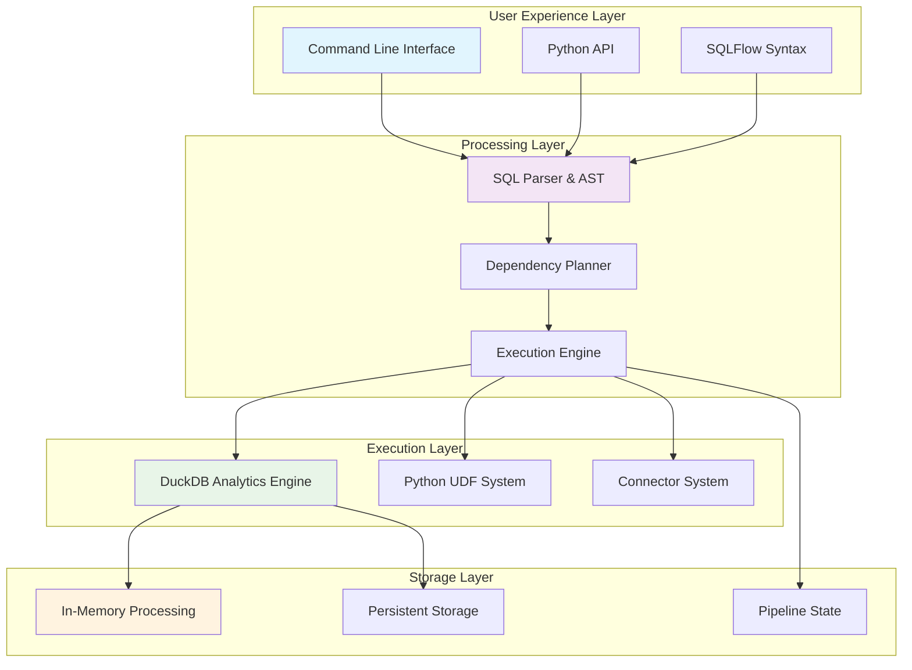
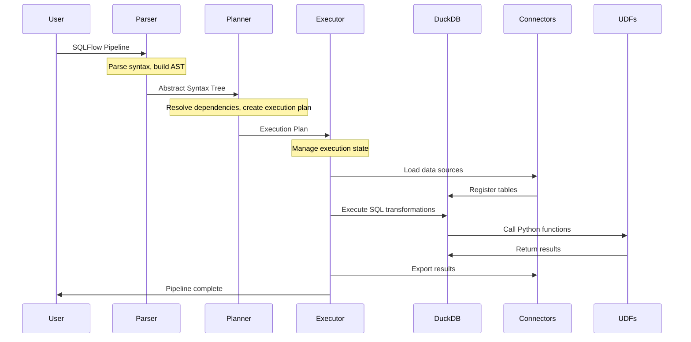

# SQLFlow Architecture Overview

## The Vision Behind SQLFlow's Architecture

SQLFlow's architecture embodies a simple but powerful philosophy: **data pipeline development should be as simple as writing SQL**. Every architectural decision supports this vision by removing complexity barriers that traditionally separate analysts from their data.

### Core Philosophy

**"SQL Should Be Enough"**
- SQL is the universal language of data analysis
- Analysts shouldn't need to learn complex orchestration tools
- Business logic should be expressed in business terms, not infrastructure code
- Data pipelines should be readable by anyone who understands SQL

**Democratization Through Simplicity**
- No external infrastructure dependencies
- Zero configuration for getting started
- Gradual complexity - start simple, add power when needed
- Human-readable pipeline definitions

## Architectural Principles

### 1. Embedded-First Design

```
Traditional Data Pipeline:
Developer → Kubernetes → Airflow → Spark → Database → Results
         ↳ Infrastructure complexity barrier

SQLFlow Approach:
Analyst → SQL → Results
       ↳ Direct path to insights
```

SQLFlow embeds all execution capabilities, eliminating infrastructure management:
- **No servers to manage** - Runs anywhere Python runs
- **No external dependencies** - Everything needed is bundled
- **No configuration overhead** - Works out of the box

### 2. SQL-Native Processing

SQL remains the primary interface, enhanced rather than replaced:
- **Pure SQL transformations** using DuckDB's advanced analytics
- **Python UDFs** for custom business logic
- **Connector system** bringing external data into SQL context
- **Pipeline syntax** that extends SQL naturally

### 3. Modular Extensibility

Clean interfaces enable customization without complexity:
- **Connector interface** for new data sources
- **UDF decorators** for custom functions
- **Engine abstraction** for future execution backends
- **Registry patterns** for automatic discovery

## System Architecture Layers



### User Experience Layer

**Purpose**: Make data pipeline development accessible to all skill levels

**Philosophy**: The interface should disappear - users focus on *what* they want to analyze, not *how* to orchestrate it.

**Key Components**:
- **CLI**: Familiar terminal commands for operations teams
- **Python API**: Integration with existing Python workflows
- **SQLFlow Syntax**: SQL with minimal extensions for pipeline concepts

### Processing Layer

**Purpose**: Transform user intent into executable operations

**Philosophy**: Intelligence should be built into the system, not required from users.

**Key Components**:
- **Parser**: Understands SQLFlow syntax and business logic
- **Planner**: Automatically resolves dependencies and execution order
- **Executor**: Manages execution with state tracking and recovery

### Execution Layer  

**Purpose**: Provide powerful data processing capabilities with minimal overhead

**Philosophy**: Leverage best-in-class tools while hiding their complexity.

**Key Components**:
- **DuckDB Engine**: Columnar analytics with ACID guarantees
- **UDF System**: Bring Python's ecosystem into SQL context
- **Connector System**: Unified interface to any data source

### Storage Layer

**Purpose**: Flexible data persistence matching user needs

**Philosophy**: Start simple with memory, scale to persistence when needed.

**Key Components**:
- **Memory Processing**: Instant feedback for development
- **Persistent Storage**: Production reliability with ACID compliance
- **State Management**: Pipeline continuity and incremental processing

## Component Interaction Philosophy

### Data Flow Architecture



### Intelligence Distribution

**Smart Defaults, Explicit Control**
- System makes intelligent choices by default
- Users can override any decision when needed
- Progressive disclosure of advanced features

**Dependency Intelligence**
- Automatic dependency detection from SQL references
- Cycle detection and prevention
- Optimal execution ordering

**Resource Intelligence**
- Memory management with automatic spilling
- Connection pooling and reuse
- Incremental processing with watermarks

## Design Patterns

### 1. Convention Over Configuration

```sql
-- This just works - no configuration needed
SOURCE customers FROM postgres PARAMS {...};
LOAD customer_data FROM customers;

CREATE TABLE customer_metrics AS
SELECT customer_id, COUNT(*) as orders
FROM customer_data 
GROUP BY customer_id;
```

**Philosophy**: Common patterns should require minimal specification.

### 2. Registry-Based Discovery

```python
# Connectors auto-register when imported
@register_connector("MYAPI")
class MyAPIConnector(Connector):
    pass

# UDFs auto-register when decorated  
@python_scalar_udf
def my_calculation(value: float) -> float:
    return value * 2
```

**Philosophy**: Extensions should integrate seamlessly without manual wiring.

### 3. Graceful Degradation

```python
# Missing dependencies don't break core functionality
try:
    from complex_library import advanced_connector
except ImportError:
    # System continues working with available connectors
    advanced_connector = None
```

**Philosophy**: Advanced features enhance the platform but never block basic usage.

## Scalability Philosophy

### Vertical Scaling First

SQLFlow optimizes for single-machine performance before distributed complexity:

**Reasoning**: 
- 80% of analytics workloads fit on single machines
- Vertical scaling eliminates network overhead
- DuckDB's columnar engine rivals distributed systems for many use cases
- Simpler deployment and debugging

**Approach**:
- Leverage all CPU cores through DuckDB's parallelism
- Memory-efficient columnar processing
- Intelligent spilling for larger-than-memory datasets
- NVME storage optimization for persistent workloads

### Horizontal Scaling Through Decomposition

When single machines aren't enough, scale by breaking problems apart:

```sql
-- Temporal decomposition
SOURCE daily_events FROM s3 PARAMS { "path": "events/{date}/" };

-- Domain decomposition  
SOURCE customer_events FROM api PARAMS { "endpoint": "/customers" };
SOURCE product_events FROM api PARAMS { "endpoint": "/products" };
```

**Philosophy**: Scale by problem decomposition, not infrastructure complexity.

## Future Architecture Vision

### Extensible Function Ecosystem

**Vision**: Python UDFs become a shareable ecosystem like npm packages:

```sql
-- Import community-developed functions
PYTHON_UDFS FROM "finance-utils>=1.0.0";
PYTHON_UDFS FROM "ml-preprocessing>=2.1.0";

-- Use specialized industry functions
SELECT calculate_ltv(revenue, churn_rate) as customer_value
FROM customers;
```

**Technical Foundation**:
- UDF discovery system already supports module loading
- Registry pattern enables package management integration
- Metadata system supports versioning and documentation
- Isolation patterns for security and stability

### Multi-Engine Abstraction

**Vision**: Support multiple execution engines while preserving SQL interface:

```yaml
# Profile-based engine selection
engines:
  local:
    type: duckdb
    mode: memory
  
  production:
    type: duckdb  
    mode: persistent
    
  distributed:
    type: spark
    cluster: production-cluster
```

**Technical Foundation**:
- Engine abstraction layer already exists
- Connector pattern works across engines
- UDF system designed for engine independence

### Intelligent Optimization

**Vision**: System learns from usage patterns to optimize automatically:

```sql
-- System automatically chooses optimal strategies
CREATE TABLE customer_metrics AS
SELECT customer_id, COUNT(*) as orders
FROM large_table
GROUP BY customer_id;
-- Auto-detected: Use columnar grouping, enable parallel execution
```

**Technical Foundation**:
- Execution statistics collection infrastructure
- Pluggable optimization strategies
- Performance monitoring and adaptation

## Summary: Architecture as Philosophy

SQLFlow's architecture isn't just about technical components - it's about democratizing data analysis:

**For Data Analysts**: SQL syntax they already know, enhanced with powerful capabilities
**For Data Engineers**: Production-ready infrastructure without operational complexity  
**For Organizations**: Faster time-to-insight with lower total cost of ownership

Every architectural decision asks: "Does this make data analysis more accessible?" The answer shapes every component, every interface, and every optimization.

The result is a platform where **SQL is truly enough** for building sophisticated data pipelines, while maintaining the power and flexibility needed for complex analytical workloads.

---

**Next**: Explore detailed component architectures:
- [Engine Layer](engine-layer.md) - DuckDB integration and storage
- [Processing Layer](processing-layer.md) - Parser, planner, and executor  
- [UDF System](udf-system.md) - Python function integration
- [Connector Architecture](connector-architecture.md) - Data source abstraction
- [State Management](state-management.md) - Pipeline persistence and recovery 