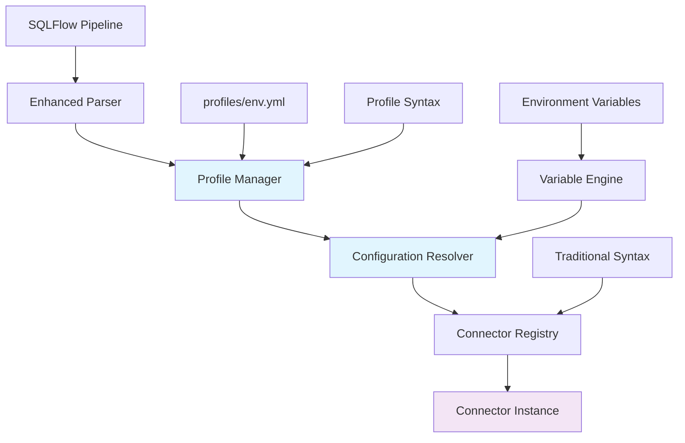

# SQLFlow Profile-Based Connector Configuration: Technical Design & Implementation Plan

## Executive Summary

**Objective**: Implement profile-based connector configuration with zero impact on existing and new connectors.

**Key Principle**: Profile resolution is transparent to connectors - they receive final resolved configuration without knowing about profiles.

---

## 1. High-Level Architecture



## 2. Component Design Specifications

### 2.1 Profile Manager (New Component)

```python
class ProfileManager:
    """Centralized profile configuration management."""
    
    def __init__(self, profile_dir: str, environment: str):
        self.profile_dir = profile_dir
        self.environment = environment
        self._profile_cache: Dict[str, Dict] = {}
        self._variable_engine = VariableSubstitutionEngine()
    
    def load_profile(self) -> Dict[str, Any]:
        """Load environment-specific profile with caching."""
        
    def get_connector_profile(self, connector_name: str) -> ConnectorProfile:
        """Get specific connector configuration from profile."""
        
    def validate_profile(self, profile_path: str) -> ValidationResult:
        """Validate profile YAML structure and required fields."""
```

### 2.2 Configuration Resolver (New Component)

```python
class ConfigurationResolver:
    """Handles configuration merging and variable substitution."""
    
    def resolve_config(
        self, 
        profile_name: str, 
        options: Dict[str, Any],
        variables: Dict[str, Any]
    ) -> Dict[str, Any]:
        """
        Merge profile config with OPTIONS override.
        Priority: OPTIONS > Profile PARAMS > Default Values
        """
        
    def substitute_variables(self, config: Dict, variables: Dict) -> Dict:
        """Apply variable substitution to configuration values."""
```

### 2.3 Enhanced Parser (Modified Component)

**Grammar Extension:**
```antlr
source_definition
    : SOURCE IDENTIFIER TYPE IDENTIFIER PARAMS json_object     # Traditional
    | SOURCE IDENTIFIER FROM STRING OPTIONS json_object        # Profile-based
    ;
```

**AST Node Enhancement:**
```python
@dataclass
class SourceDefinitionStep:
    name: str
    connector_type: Optional[str] = None          # For traditional syntax
    params: Optional[Dict[str, Any]] = None       # For traditional syntax
    profile_name: Optional[str] = None            # For profile syntax
    options: Optional[Dict[str, Any]] = None      # For profile syntax
    is_from_profile: bool = False
```

---

## 3. Implementation Tasks & Definition of Done

### **PHASE 1: Foundation Components (Week 1-2)**

#### Task 1.1: Profile Manager Implementation
**Owner**: Backend Developer  
**Estimate**: 3 days

**DOD:**
- [ ] `ProfileManager` class implemented with caching
- [ ] YAML profile loading with schema validation
- [ ] Support for environment-specific profiles (`profiles/{env}.yml`)
- [ ] Profile validation with clear error messages
- [ ] Profile caching mechanism (LRU cache, TTL-based)
- [ ] Unit tests covering:
  - [ ] Valid profile loading
  - [ ] Invalid YAML handling
  - [ ] Missing profile handling
  - [ ] Profile caching behavior
  - [ ] Environment switching
- [ ] Performance benchmark: Profile loading < 50ms
- [ ] Memory usage test: No memory leaks in long-running processes

**Implementation Details:**
```python
class ProfileManager:
    def load_profile(self) -> Dict[str, Any]:
        profile_path = f"{self.profile_dir}/{self.environment}.yml"
        if profile_path in self._profile_cache:
            return self._profile_cache[profile_path]
            
        with open(profile_path, 'r') as f:
            profile_data = yaml.safe_load(f)
            
        self._validate_profile_schema(profile_data)
        self._profile_cache[profile_path] = profile_data
        return profile_data
```

#### Task 1.2: Configuration Resolver Implementation
**Owner**: Backend Developer  
**Estimate**: 2 days

**DOD:**
- [ ] `ConfigurationResolver` class implemented
- [ ] Configuration merging logic (OPTIONS override profile PARAMS)
- [ ] Variable substitution integration
- [ ] Type coercion for configuration values
- [ ] Unit tests covering:
  - [ ] Basic config merging
  - [ ] Variable substitution in values
  - [ ] Nested object merging
  - [ ] Type conversion (string to int, bool, etc.)
  - [ ] Edge cases (null values, empty configs)
- [ ] Integration tests with `VariableSubstitutionEngine`
- [ ] Documentation with examples

**Configuration Resolution Algorithm:**
```python
def resolve_config(self, profile_name: str, options: Dict) -> Dict:
    # 1. Get connector defaults
    connector_type = self.profile_manager.get_connector_type(profile_name)
    defaults = self.connector_registry.get_defaults(connector_type)
    
    # 2. Get profile params
    profile_config = self.profile_manager.get_connector_profile(profile_name)
    
    # 3. Merge with precedence: OPTIONS > Profile > Defaults
    resolved = {**defaults, **profile_config.params, **options}
    
    # 4. Apply variable substitution
    return self.variable_engine.substitute(resolved)
```

#### Task 1.3: YAML Schema Definition & Validation
**Owner**: Backend Developer  
**Estimate**: 1 day

**DOD:**
- [ ] YAML schema for profile structure defined
- [ ] Schema validation using `jsonschema` or similar
- [ ] Clear validation error messages with line numbers
- [ ] Support for schema versioning
- [ ] Unit tests for schema validation
- [ ] Documentation with complete schema reference

**Profile Schema:**
```yaml
# Schema definition
version: "1.0"  # Required
variables:      # Optional
  key: value
connectors:     # Required
  connector_name:
    type: string      # Required
    params:           # Required (can be empty)
      key: value
engines:        # Optional
  duckdb:
    mode: string
    path: string
```

---

### **PHASE 2: Parser Integration (Week 3)**

#### Task 2.1: Parser Grammar Extension
**Owner**: Parser Developer  
**Estimate**: 2 days

**DOD:**
- [ ] ANTLR grammar updated for profile syntax
- [ ] Parser generates correct AST for both syntaxes
- [ ] Syntax validation for profile names (quoted strings)
- [ ] Error handling for malformed syntax
- [ ] Unit tests covering:
  - [ ] Traditional syntax parsing (unchanged)
  - [ ] Profile syntax parsing
  - [ ] Mixed syntax in same file
  - [ ] Error cases (missing quotes, invalid syntax)
- [ ] Integration tests with existing pipeline parsing
- [ ] Backward compatibility verified

**Parser Test Cases:**
```sql
-- Test Case 1: Traditional syntax (should still work)
SOURCE data TYPE CSV PARAMS {"path": "file.csv"};

-- Test Case 2: Profile syntax
SOURCE data FROM "csv_default" OPTIONS {"path": "file.csv"};

-- Test Case 3: Mixed in same file
SOURCE data1 TYPE CSV PARAMS {"path": "file1.csv"};
SOURCE data2 FROM "csv_default" OPTIONS {"path": "file2.csv"};
```

#### Task 2.2: AST Node Enhancement
**Owner**: Parser Developer  
**Estimate**: 1 day

**DOD:**
- [ ] `SourceDefinitionStep` class updated with profile fields
- [ ] Proper serialization/deserialization support
- [ ] AST visitor pattern support for new fields
- [ ] Unit tests for AST node creation and manipulation
- [ ] Integration tests with AST-to-DAG conversion
- [ ] Documentation for AST structure changes

---

### **PHASE 3: Executor Integration (Week 4)**

#### Task 3.1: LocalExecutor Profile Integration
**Owner**: Core Developer  
**Estimate**: 3 days

**DOD:**
- [ ] `LocalExecutor` integrated with `ProfileManager`
- [ ] Profile-based source definition execution
- [ ] Configuration resolution before connector creation
- [ ] Error handling for missing profiles
- [ ] Unit tests covering:
  - [ ] Profile-based source creation
  - [ ] Traditional source creation (unchanged)
  - [ ] Error scenarios (missing profile, invalid config)
  - [ ] Variable substitution in profiles
- [ ] Integration tests with real connectors
- [ ] Performance tests (profile resolution overhead < 10ms)

**Integration Points:**
```python
class LocalExecutor:
    def _execute_source_definition(self, step: Dict[str, Any]) -> Dict[str, Any]:
        if step.get("is_from_profile"):
            return self._handle_profile_based_source(step)
        else:
            return self._handle_traditional_source(step)
    
    def _handle_profile_based_source(self, step: Dict[str, Any]) -> Dict[str, Any]:
        # 1. Resolve configuration
        resolved_config = self.config_resolver.resolve_config(
            profile_name=step["profile_name"],
            options=step.get("options", {}),
            variables=self.variables
        )
        
        # 2. Create connector (same as traditional)
        return self._create_connector_from_config(resolved_config)
```

#### Task 3.2: Connector Registry Enhancement
**Owner**: Core Developer  
**Estimate**: 1 day

**DOD:**
- [ ] Registry supports profile-based connector creation
- [ ] Connector default configuration management
- [ ] Type validation for connector parameters
- [ ] Unit tests for enhanced registry functionality
- [ ] Integration tests with profile resolution
- [ ] Documentation for registry changes

---

### **PHASE 4: Connector-Specific Validation (Week 5)**

#### Task 4.1: CSV Connector Profile Support Validation
**Owner**: QA Developer  
**Estimate**: 1 day

**DOD:**
- [ ] CSV connector works with profiles (no code changes)
- [ ] Path resolution with variable substitution
- [ ] Options override profile parameters correctly
- [ ] Integration tests with real CSV files
- [ ] Performance tests with large files
- [ ] Documentation with CSV profile examples

**Test Scenarios:**
```yaml
# profiles/dev.yml
connectors:
  csv_default:
    type: csv
    params:
      has_header: true
      delimiter: ","
      encoding: utf-8
```

```sql
-- Pipeline usage
SOURCE products FROM "csv_default" OPTIONS {
  "path": "./data/products.csv",
  "delimiter": "|"  -- Override profile default
};
```

#### Task 4.2: PostgreSQL Connector Profile Support Validation
**Owner**: QA Developer  
**Estimate**: 1 day

**DOD:**
- [ ] PostgreSQL connector works with profiles (no code changes)
- [ ] Connection parameter inheritance
- [ ] SSL configuration handling
- [ ] Integration tests with real database
- [ ] Connection pooling validation
- [ ] Security test (credentials not logged)

#### Task 4.3: S3 Connector Profile Support Validation
**Owner**: QA Developer  
**Estimate**: 1 day

**DOD:**
- [ ] S3 connector works with profiles (no code changes)
- [ ] AWS credential resolution
- [ ] Bucket/key parameter handling
- [ ] Integration tests with S3 (or LocalStack)
- [ ] Error handling for access denied
- [ ] Performance tests with large objects

---

### **PHASE 5: Developer Experience (Week 6)**

#### Task 5.1: Profile Management CLI
**Owner**: CLI Developer  
**Estimate**: 2 days

**DOD:**
- [ ] `sqlflow profiles list` command
- [ ] `sqlflow profiles validate` command
- [ ] `sqlflow profiles show <profile>` command
- [ ] Profile creation wizard
- [ ] Unit tests for CLI commands
- [ ] Integration tests with real profiles
- [ ] Help documentation for all commands

**CLI Commands:**
```bash
# List available profiles
sqlflow profiles list

# Validate profile syntax
sqlflow profiles validate profiles/dev.yml

# Show profile details
sqlflow profiles show csv_default

# Create new profile interactively
sqlflow profiles create
```

#### Task 5.2: Migration Tooling
**Owner**: Tools Developer  
**Estimate**: 2 days

**DOD:**
- [ ] Tool to convert inline syntax to profile-based
- [ ] Profile extraction from existing pipelines
- [ ] Batch migration support
- [ ] Dry-run mode for migration preview
- [ ] Unit tests for migration logic
- [ ] Integration tests with real pipelines
- [ ] Migration guide documentation

**Migration Tool:**
```bash
# Convert pipeline to use profiles
sqlflow migrate-to-profiles pipeline.sf --profile-dir profiles/

# Extract profiles from multiple pipelines
sqlflow extract-profiles pipelines/ --output profiles/dev.yml
```

---

### **PHASE 6: Testing & Documentation (Week 7-8)**

#### Task 6.1: Comprehensive Integration Testing
**Owner**: QA Team  
**Estimate**: 3 days

**DOD:**
- [ ] End-to-end tests for all supported connectors
- [ ] Multi-environment testing (dev/staging/prod profiles)
- [ ] Error scenario testing
- [ ] Performance benchmarking
- [ ] Load testing with concurrent profile access
- [ ] Security testing (credential handling)
- [ ] Test coverage > 90% for new components

#### Task 6.2: Documentation & Examples
**Owner**: Technical Writer  
**Estimate**: 2 days

**DOD:**
- [ ] Complete profile configuration guide
- [ ] Per-connector profile examples
- [ ] Migration guide from inline syntax
- [ ] Best practices documentation
- [ ] Troubleshooting guide
- [ ] API documentation for new components
- [ ] Video tutorial for profile setup

#### Task 6.3: Performance Optimization
**Owner**: Performance Engineer  
**Estimate**: 2 days

**DOD:**
- [ ] Profile loading performance optimized
- [ ] Memory usage profiling and optimization
- [ ] Configuration resolution benchmark < 10ms
- [ ] Cache efficiency optimization
- [ ] Resource cleanup validation
- [ ] Performance regression tests
- [ ] Production readiness checklist

---

## 4. Risk Assessment & Mitigation

### High Risk Items

**Risk 1: Backward Compatibility**
- **Mitigation**: Comprehensive regression testing, feature flags
- **Validation**: All existing pipelines work unchanged

**Risk 2: Profile Resolution Performance**
- **Mitigation**: Caching, lazy loading, performance benchmarking
- **Validation**: < 50ms profile loading, < 10ms config resolution

**Risk 3: Configuration Complexity**
- **Mitigation**: Clear documentation, CLI tooling, validation
- **Validation**: User testing with new developers

### Medium Risk Items

**Risk 4: Variable Substitution Edge Cases**
- **Mitigation**: Comprehensive test coverage, error handling
- **Validation**: Edge case testing (nested variables, circular refs)

**Risk 5: Multi-Environment Configuration Drift**
- **Mitigation**: Profile validation tooling, CI/CD integration
- **Validation**: Environment consistency checks

## 5. Success Metrics

### Technical Metrics
- [ ] Profile loading time < 50ms (99th percentile)
- [ ] Configuration resolution time < 10ms (average)
- [ ] Zero memory leaks in 24-hour stress test
- [ ] 100% backward compatibility maintained
- [ ] Test coverage > 90% for new components

### User Experience Metrics
- [ ] New connector development time unchanged
- [ ] Profile setup time < 10 minutes for new environments
- [ ] Migration time < 30 minutes per pipeline
- [ ] Developer satisfaction score > 8/10

### System Metrics
- [ ] Zero breaking changes to existing connectors
- [ ] All existing tests pass unchanged
- [ ] Production deployment with zero downtime
- [ ] Error rate < 0.1% for profile operations

---

## 6. Timeline Summary

| Phase | Duration | Key Deliverables |
|-------|----------|------------------|
| Phase 1 | Week 1-2 | Profile Manager, Config Resolver |
| Phase 2 | Week 3 | Parser Integration |
| Phase 3 | Week 4 | Executor Integration |
| Phase 4 | Week 5 | Connector Validation |
| Phase 5 | Week 6 | Developer Experience |
| Phase 6 | Week 7-8 | Testing & Docs |

**Total Duration**: 8 weeks  
**Team Size**: 4-5 developers  
**Estimated Effort**: 160-200 person-hours

---

## 7. Post-Implementation Plan

### Monitoring & Maintenance
- [ ] Profile access performance monitoring
- [ ] Error rate tracking for profile operations
- [ ] User adoption metrics
- [ ] Documentation feedback collection

### Future Enhancements
- [ ] Profile inheritance (extend profiles)
- [ ] Secret management integration
- [ ] Profile templates/scaffolding
- [ ] IDE integration (VS Code extension)

**Implementation Ready**: All tasks defined with clear DODs and acceptance criteria.