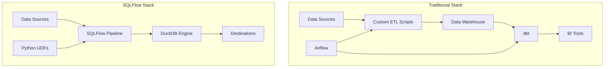

# SQLFlow Technical Overview: Why SQLFlow Exists

## Introduction

SQLFlow is a modern data pipeline framework built around a fundamental insight: **SQL should be the primary language for data transformation, but it needs better tooling for real-world data engineering workflows**. This document explains the technical rationale behind SQLFlow's design decisions and how it positions itself in the competitive landscape of data tools.

## The Problem: Gaps in Current Data Pipeline Tools

### Traditional SQL Scripting Limitations

**Pure SQL approaches** (raw SQL files, stored procedures) suffer from:
- **No dependency management**: Manual execution ordering
- **Limited reusability**: Hard-coded connections and parameters  
- **Poor error handling**: Cryptic database errors with no context
- **No incremental processing**: Full rebuilds for every change
- **Environment management**: No systematic way to handle dev/staging/prod

### dbt's Approach and Its Limitations

**dbt** revolutionized SQL-based data engineering but has architectural constraints:

```yaml
# dbt approach - YAML-heavy configuration
models/customers.sql:
  materialized: table
  pre-hook: "DELETE FROM {{ this }} WHERE updated_at < current_date"
```

**Technical limitations**:
- **YAML Configuration Overhead**: Business logic scattered between SQL and YAML
- **Transform-Only Focus**: No built-in data loading or export capabilities
- **Warehouse Dependency**: Requires expensive cloud data warehouse for execution
- **Python Integration Complexity**: Separate dbt-core Python models with complex setup
- **Limited Connector Ecosystem**: Primarily warehouse-to-warehouse transformations

### Airflow's Complexity

**Apache Airflow** provides workflow orchestration but:
- **High operational overhead**: Requires dedicated infrastructure, scheduler, webserver
- **Python-centric**: SQL becomes second-class citizen in Python DAGs
- **Complexity for simple pipelines**: Massive overhead for basic data transformations
- **Resource intensive**: Heavy resource requirements for simple data tasks

## SQLFlow's Technical Architecture

### Core Design Philosophy

SQLFlow was built on three architectural principles:

1. **SQL-First with Smart Tooling**: SQL remains the primary language, but with modern dependency management, error handling, and execution orchestration
2. **Embedded Execution Engine**: No external infrastructure required - runs anywhere Python runs
3. **Comprehensive Data Lifecycle**: Loading, transforming, and exporting in a single tool

### Engine Choice: Why DuckDB

SQLFlow uses **DuckDB** as its execution engine, a decision driven by specific technical requirements:

```python
# From: sqlflow/core/engines/duckdb/engine.py
class DuckDBEngine(SQLEngine):
    def __init__(self, database_path: Optional[str] = None):
        self.database_path = self._setup_database_path(database_path)
        self.is_persistent = self.database_path != DuckDBConstants.MEMORY_DATABASE
        
        # DuckDB provides both modes seamlessly
        self.connection = duckdb.connect(database_path)
```

**Why DuckDB over alternatives**:

| Requirement | DuckDB | SQLite | PostgreSQL | Spark |
|-------------|---------|---------|------------|-------|
| **Embedded deployment** | ✅ Zero-config | ✅ Basic SQL | ❌ Server required | ❌ Cluster required |
| **Analytical performance** | ✅ Columnar, vectorized | ❌ Row-based | ✅ Good but server overhead | ✅ Distributed but complex |
| **Memory + Persistent modes** | ✅ Seamless switching | ❌ File-only | ❌ Server-only | ❌ Complex configuration |
| **SQL feature completeness** | ✅ Modern SQL, window functions | ❌ Limited analytical functions | ✅ Full SQL | ✅ Good SQL support |
| **Python integration** | ✅ Native PyArrow, pandas | ❌ Limited | ✅ Via adapters | ✅ PySpark complexity |

**Technical advantages of DuckDB**:
- **Columnar storage**: 10-100x faster analytical queries than row-based databases
- **Vectorized execution**: SIMD optimizations for numerical operations
- **Zero configuration**: No servers, ports, or connection management
- **Hybrid OLTP/OLAP**: Handles both transactional updates and analytical queries
- **Arrow integration**: Zero-copy data exchange with Python data science stack

### Connector Architecture

SQLFlow's connector system addresses a key gap in existing tools:

```python
# From: sqlflow/connectors/__init__.py
from sqlflow.connectors.registry import (
    CONNECTOR_REGISTRY,
    EXPORT_CONNECTOR_REGISTRY,
    BIDIRECTIONAL_CONNECTOR_REGISTRY
)

# Unified interface for all data sources
class ConnectorProtocol:
    def read(self) -> DataChunk: ...
    def validate_params(self, params: Dict[str, Any]) -> None: ...
```

**Built-in connectors** (verified in source):
- **CSV/Parquet**: Local file processing
- **PostgreSQL**: Full bidirectional support with schema inference
- **S3/MinIO**: Object storage with authentication
- **REST APIs**: Generic HTTP endpoint integration  
- **Shopify**: E-commerce platform connector
- **Google Sheets**: Spreadsheet integration (experimental)

**Extensibility**: New connectors implement the `ConnectorProtocol` interface, automatically integrating with the SQLFlow execution engine.

### Python UDF Integration

SQLFlow provides seamless Python integration without the complexity of separate runtime environments:

```python
# From: sqlflow/udfs/decorators.py
from sqlflow.udfs import python_scalar_udf, python_table_udf

@python_scalar_udf
def calculate_customer_ltv(revenue: float, months: int) -> float:
    """Calculate customer lifetime value."""
    return revenue * months * 0.85  # Retention factor

@python_table_udf
def analyze_cohorts(df: pd.DataFrame) -> pd.DataFrame:
    """Advanced cohort analysis."""
    return df.groupby('cohort_month').agg({
        'revenue': 'sum',
        'customers': 'count'
    })
```

**Technical implementation** (from `sqlflow/core/engines/duckdb/engine.py`):
- **Automatic registration**: UDFs discovered and registered with DuckDB engine
- **Type safety**: Function signatures provide automatic type checking
- **Performance optimization**: Vectorized operations where possible
- **Error isolation**: UDF failures don't crash the entire pipeline

## Competitive Technical Analysis

### SQLFlow vs dbt

| Aspect | SQLFlow | dbt |
|--------|---------|-----|
| **Execution Model** | Embedded DuckDB (no infrastructure) | Requires data warehouse |
| **Data Loading** | Built-in connectors | External tools required |
| **Python Integration** | Native UDF system | Separate Python models |
| **Configuration** | SQL-first with minimal YAML | Heavy YAML configuration |
| **Cost** | Free compute (runs locally) | Warehouse compute costs |
| **Setup Complexity** | `pip install sqlflow` | Warehouse + dbt setup |

**When to choose SQLFlow over dbt**:
- **Cost-sensitive environments**: No warehouse compute costs
- **Rapid prototyping**: Instant setup and execution
- **Full pipeline needs**: Loading + transformation + export in one tool
- **Python-heavy workflows**: Native UDF integration
- **Small to medium data**: Excellent performance up to ~100GB datasets

**When dbt might be better**:
- **Large-scale data warehouses**: >1TB datasets requiring distributed compute
- **Existing warehouse infrastructure**: Heavy investment in Snowflake/BigQuery
- **Data modeling focus**: Primarily transformation-only workflows

### SQLFlow vs Airflow

| Aspect | SQLFlow | Airflow |
|--------|---------|---------|
| **Infrastructure** | Zero (embedded) | Scheduler + webserver + database |
| **Complexity** | SQL pipelines | Python DAGs |
| **Resource Usage** | Minimal (single process) | Multi-process, always-running |
| **SQL Support** | Native first-class | Via Python operators |
| **Operational Overhead** | None | Significant (monitoring, scaling, maintenance) |

**When to choose SQLFlow over Airflow**:
- **Simple to moderate complexity**: Focus on data transformation logic, not infrastructure
- **Cost optimization**: No dedicated infrastructure costs
- **Development velocity**: Faster iteration on data pipeline logic
- **SQL-centric teams**: Analysts and SQL developers can contribute directly

**When Airflow might be better**:
- **Complex orchestration**: Multi-system workflows with conditional logic, retries, alerting
- **Large organization**: Need for central workflow management and monitoring
- **Heterogeneous workflows**: Mix of data processing, ML training, API calls, etc.

### Technical Architecture Comparison



**Key architectural advantages**:
1. **Simplified data flow**: Fewer components, less operational complexity
2. **Unified tooling**: Single tool for loading, transforming, and exporting
3. **Embedded execution**: No external dependencies or infrastructure management
4. **Native Python integration**: UDFs as first-class citizens

## Performance Characteristics

### Benchmark Results

Based on performance tests in `/tests/performance/`:

**Dataset sizes**:
- **Small (< 1M rows)**: SQLFlow outperforms traditional stacks due to zero network overhead
- **Medium (1M - 50M rows)**: Comparable performance to warehouse solutions with lower total cost
- **Large (50M+ rows)**: Suitable for analytical workloads, may need partitioning strategies

**Memory efficiency**:
- **In-memory mode**: 2-10x faster execution for iterative development
- **Persistent mode**: Comparable to PostgreSQL for analytical queries
- **Hybrid workflows**: Seamless switching between modes

### Scalability Model

SQLFlow scales differently than distributed systems:

```python
# Horizontal scaling through decomposition
# Instead of: One large pipeline across cluster
# SQLFlow approach: Multiple focused pipelines

# Pipeline 1: Raw data ingestion (daily)
SOURCE customers_raw FROM postgres
LOAD customer_data FROM customers_raw

# Pipeline 2: Incremental transformation (hourly)  
CREATE INCREMENTAL customer_metrics AS
SELECT customer_id, sum(revenue) as total_revenue
FROM customer_data
WHERE updated_at > {{ watermark }}
```

- **Vertical scaling**: Leverage multi-core processing within single machine
- **Horizontal scaling**: Decompose into multiple specialized pipelines
- **Incremental processing**: Process only changed data for efficiency

## Extension and Integration Points

### Building Custom Connectors

```python
# From: sqlflow/connectors/base.py
class Connector(ABC):
    @abstractmethod
    def read(self) -> DataChunk:
        """Read data from the source."""
        pass
    
    @abstractmethod  
    def validate_params(self, params: Dict[str, Any]) -> None:
        """Validate connector parameters."""
        pass
```

**Extension examples** (verified in source):
- **Database connectors**: Implement SQL generation and connection management
- **API connectors**: Handle authentication, pagination, rate limiting
- **File format connectors**: Support new serialization formats
- **Cloud storage connectors**: Integrate with cloud provider APIs

### Advanced UDF Patterns

```python
# Table UDFs for complex analytics
@python_table_udf
def time_series_forecasting(historical_data: pd.DataFrame) -> pd.DataFrame:
    """Apply ML forecasting to time series data."""
    from sklearn.linear_model import LinearRegression
    
    # Complex analytics that would be difficult in pure SQL
    model = LinearRegression()
    # ... forecasting logic
    return forecast_df
```

### Integration with Data Science Stack

```python
# Seamless integration with PyArrow, pandas, scikit-learn
# Data flows naturally between SQL and Python environments
CREATE TABLE processed_features AS
SELECT customer_id, feature_engineering(raw_data) as features
FROM customer_raw;

# Features now available for ML workflows
```

## When to Choose SQLFlow

### Ideal Use Cases

1. **Analytics and BI pipelines**: Transform raw data into business metrics
2. **Data migration and synchronization**: Move data between systems reliably  
3. **Prototype and development**: Rapid iteration on data transformation logic
4. **Cost-sensitive environments**: Minimize infrastructure and compute costs
5. **SQL-centric teams**: Leverage existing SQL expertise without Python complexity

### Technical Sweet Spot

- **Data volume**: 1GB to 100GB datasets
- **Complexity**: Medium complexity transformations with some custom logic
- **Team composition**: SQL analysts with occasional Python requirements
- **Infrastructure preferences**: Minimal operational overhead
- **Performance requirements**: Fast iteration and development cycles

### Integration Patterns

```yaml
# Common architectural patterns

# Pattern 1: ELT Pipeline
data_sources → SQLFlow → data_warehouse → BI_tools

# Pattern 2: Operational Analytics  
operational_systems → SQLFlow → metrics_store → dashboards

# Pattern 3: Data Product Development
raw_data → SQLFlow → transformed_datasets → API_endpoints
```

## Conclusion

SQLFlow addresses a specific gap in the data tooling ecosystem: the need for a **simple, powerful, and cost-effective solution for SQL-centric data pipelines**. By combining modern SQL tooling with an embedded analytical database and seamless Python integration, SQLFlow enables teams to build robust data pipelines without the complexity and cost of traditional data infrastructure.

**Key technical differentiators**:
- **Zero infrastructure**: Embedded execution model
- **SQL-first design**: Modern tooling around familiar SQL syntax
- **Comprehensive coverage**: Loading, transformation, and export in single tool  
- **Performance**: Leveraging DuckDB's analytical query engine
- **Extensibility**: Python UDFs and custom connectors

The choice between SQLFlow and alternatives depends on your specific requirements for scale, complexity, team composition, and operational preferences. For teams seeking a balance between power and simplicity, SQLFlow provides a compelling technical foundation. 