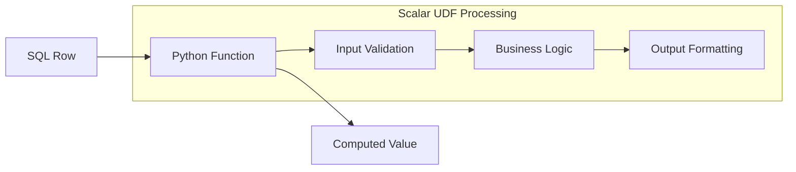
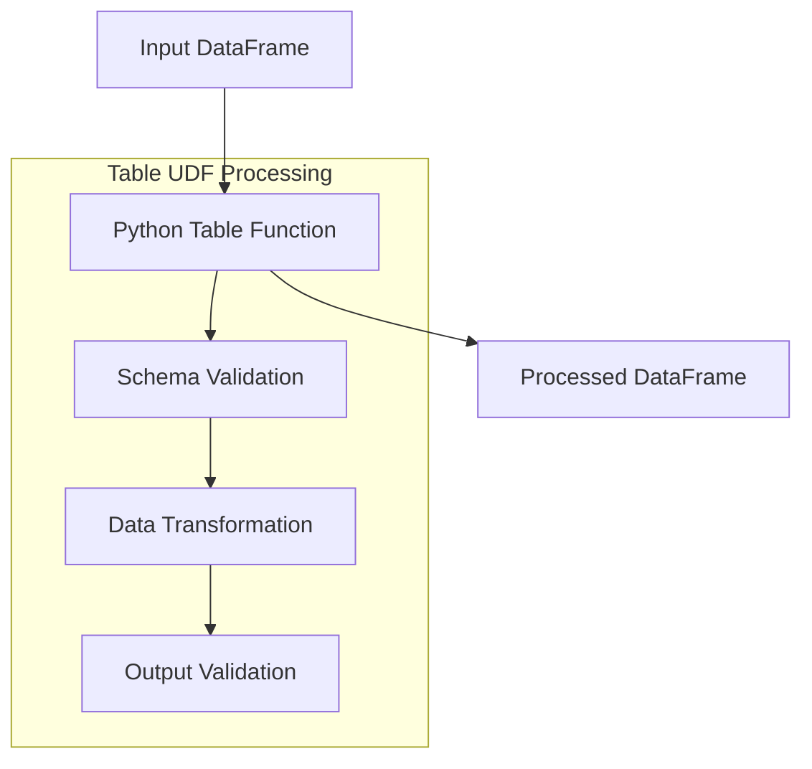
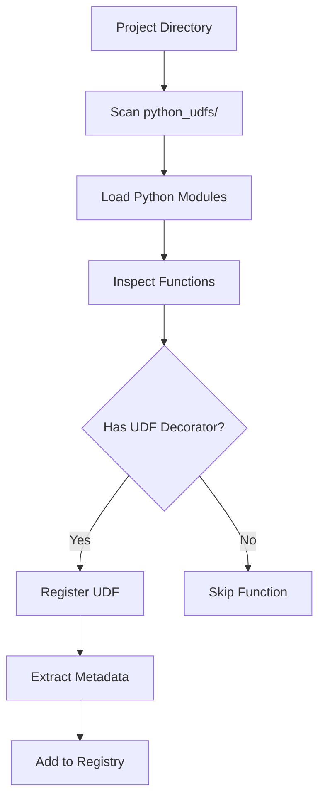
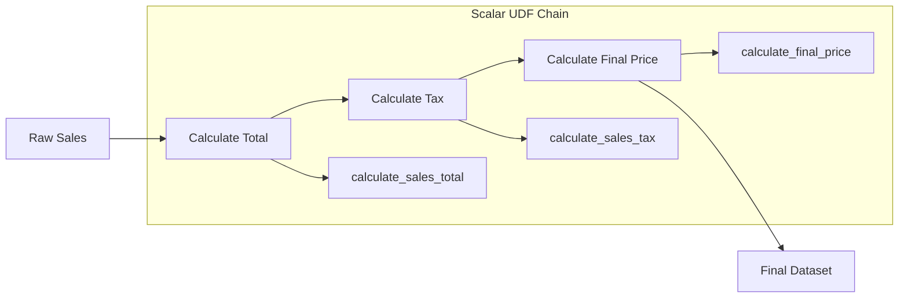
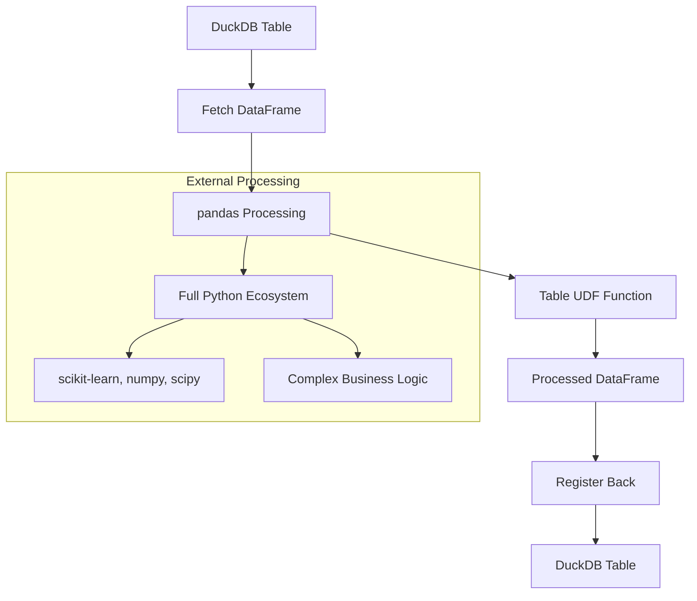
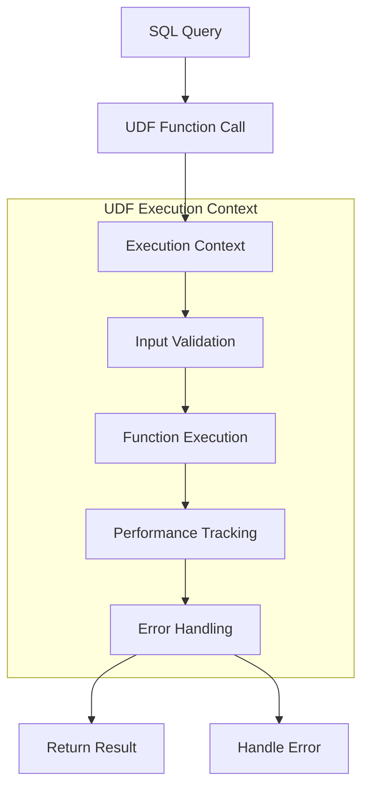

# SQLFlow UDF System Architecture

## Introduction

The SQLFlow UDF (User-Defined Function) system bridges the gap between SQL's analytical power and Python's computational ecosystem. It allows analysts and data engineers to seamlessly integrate custom business logic, complex calculations, and specialized libraries into their SQL workflows.

## UDF System Philosophy

### "Extend SQL, Don't Replace It"

The UDF system follows SQLFlow's core principle of making SQL more powerful rather than forcing users to abandon it:

```sql
-- SQL stays SQL, enhanced with Python power
SELECT 
    customer_id,
    calculate_ltv(revenue, churn_rate) AS lifetime_value,
    is_high_value_customer(revenue, tier) AS vip_status
FROM customers;
```

### Design Principles

1. **Zero Friction Integration**: UDFs should feel like native SQL functions
2. **Type Safety**: Clear parameter and return type definitions
3. **Error Isolation**: UDF failures don't crash pipelines
4. **Performance Awareness**: Efficient execution with minimal overhead
5. **Discoverability**: Automatic registration and metadata extraction

## UDF Types and Architecture

### Scalar UDFs: Row-by-Row Processing

**Purpose**: Process individual values with custom logic



**Implementation Pattern**:
```python
# Source: sqlflow/udfs/decorators.py
from sqlflow.udfs import python_scalar_udf

@python_scalar_udf
def calculate_tax(price: float, tax_rate: float = 0.1) -> float:
    """Calculate tax on a price with optional rate."""
    if price is None:
        return None
    return price * tax_rate
```

**Usage in SQL**:
```sql
-- Direct function call syntax
SELECT 
    product_id,
    price,
    PYTHON_FUNC("python_udfs.tax_utils.calculate_tax", price, 0.08) AS tax_amount
FROM products;
```

### Table UDFs: DataFrame Processing

**Purpose**: Process entire datasets with complex transformations



**Implementation Pattern**:
```python
# Source: examples/udf_examples/python_udfs/data_transforms.py
from sqlflow.udfs import python_table_udf
import pandas as pd

@python_table_udf(
    output_schema={
        "id": "INTEGER",
        "customer_id": "INTEGER", 
        "product": "VARCHAR",
        "price": "DOUBLE",
        "quantity": "INTEGER",
        "total": "DOUBLE",        # New calculated column
        "tax": "DOUBLE",          # New calculated column
        "final_price": "DOUBLE"   # New calculated column
    }
)
def add_sales_metrics(df: pd.DataFrame) -> pd.DataFrame:
    """Add calculated sales metrics to DataFrame."""
    result = df.copy()
    
    # Calculate total
    result["total"] = result["price"] * result["quantity"]
    
    # Calculate tax at 10%
    result["tax"] = result["total"] * 0.1
    
    # Calculate final price
    result["final_price"] = result["total"] + result["tax"]
    
    return result
```

## UDF Discovery and Registration

### Automatic Discovery System

SQLFlow automatically discovers UDFs in your project structure:



**Discovery Process** (from `sqlflow/udfs/manager.py`):

1. **Scan Directory**: Find all `.py` files in `python_udfs/`
2. **Load Modules**: Safely import Python modules
3. **Function Inspection**: Use Python's `inspect` module to analyze functions
4. **Decorator Detection**: Identify `@python_scalar_udf` and `@python_table_udf` decorators
5. **Metadata Extraction**: Capture function signatures, docstrings, and type hints
6. **Registry Storage**: Store UDFs with fully qualified names

**Example Discovery Results**:
```bash
# Command: sqlflow udf list
Found UDFs:
- python_udfs.text_utils.capitalize_words (scalar)
- python_udfs.text_utils.extract_domain (scalar)
- python_udfs.data_transforms.add_sales_metrics (table)
- python_udfs.tax_functions.calculate_tax (scalar)
```

### UDF Registry Architecture

```python
# Source: sqlflow/udfs/manager.py
class PythonUDFManager:
    def __init__(self, project_dir: Optional[str] = None):
        self.udfs: Dict[str, Callable] = {}           # Function registry
        self.udf_info: Dict[str, Dict[str, Any]] = {} # Metadata registry
        self.discovery_errors: Dict[str, str] = {}    # Error tracking
        
    def discover_udfs(self, python_udfs_dir: str = "python_udfs") -> Dict[str, Callable]:
        """Discover and register UDFs from specified directory."""
        # Scan directory structure
        # Load modules with error handling
        # Extract function metadata
        # Register with DuckDB engine
```

## Table UDF Limitations and Workarounds

### The DuckDB Table Function Challenge

**Current Reality**: DuckDB's Python API doesn't support table functions in SQL FROM clauses.

```sql
-- ❌ This doesn't work (DuckDB Python API limitation):
SELECT * FROM PYTHON_FUNC("add_sales_metrics", raw_sales);

-- Error: Table functions cannot be used in FROM clauses
```

### Workaround 1: Scalar UDF Chains

**Strategy**: Break table operations into sequential scalar UDF steps.



**Implementation**:
```sql
-- Source: examples/udf_examples/pipelines/table_udf_alternatives.sf

-- Step 1: Calculate totals
CREATE TABLE sales_with_totals AS
SELECT
    *,
    PYTHON_FUNC("python_udfs.table_udf_alternatives.calculate_sales_total", price, quantity) AS total
FROM raw_sales;

-- Step 2: Calculate tax using pre-calculated total
CREATE TABLE sales_with_tax AS
SELECT
    *,
    PYTHON_FUNC("python_udfs.table_udf_alternatives.calculate_sales_tax", total) AS tax
FROM sales_with_totals;

-- Step 3: Calculate final price
CREATE TABLE sales_final AS
SELECT
    *,
    PYTHON_FUNC("python_udfs.table_udf_alternatives.calculate_final_price", total, tax) AS final_price
FROM sales_with_tax;
```

**Scalar UDF Functions**:
```python
# Source: examples/udf_examples/python_udfs/table_udf_alternatives.py
@python_scalar_udf
def calculate_sales_total(price: float, quantity: int) -> Optional[float]:
    """Calculate total for a sale (price * quantity)."""
    if price is None or quantity is None:
        return None
    return float(price) * quantity

@python_scalar_udf  
def calculate_sales_tax(total: float, tax_rate: float = 0.1) -> Optional[float]:
    """Calculate tax on a total amount."""
    if total is None:
        return None
    return float(total) * tax_rate

@python_scalar_udf
def calculate_final_price(total: float, tax: float) -> Optional[float]:
    """Calculate final price including tax."""
    if total is None or tax is None:
        return None
    return float(total) + float(tax)
```

### Workaround 2: External Processing

**Strategy**: Fetch data → Process with pandas → Register back to DuckDB.



**Implementation**:
```python
# Source: examples/udf_examples/demonstrate_table_udf_alternatives.py
from sqlflow.core.engines.duckdb import DuckDBEngine
from python_udfs.data_transforms import add_sales_metrics

# Initialize DuckDB engine
engine = DuckDBEngine(":memory:")

# Step 1: Fetch data from DuckDB
sales_result = engine.execute_query("SELECT * FROM sales")
sales_df = sales_result.fetchdf()

# Step 2: Process externally with table UDF
sales_with_metrics = add_sales_metrics(sales_df)

# Step 3: Register processed data back with DuckDB
engine.connection.register("sales_processed", sales_with_metrics)

# Step 4: Continue with SQL analysis
final_result = engine.execute_query("""
    SELECT product, AVG(final_price) as avg_final_price
    FROM sales_processed
    GROUP BY product
    ORDER BY avg_final_price DESC
""")
```

**Benefits of External Processing**:
- **Full pandas functionality**: Any DataFrame operation available
- **Any Python library**: scikit-learn, numpy, scipy, custom libraries
- **Easy debugging**: Test functions outside SQL context
- **Complex transformations**: Machine learning, statistical analysis

### Workaround 3: Hybrid Approach

**Strategy**: Combine SQL analytics with external processing for optimal performance.

```sql
-- Use SQL for aggregation and filtering (DuckDB's strength)
CREATE TEMP TABLE customer_summary AS
SELECT 
    customer_id,
    COUNT(*) as purchase_count,
    SUM(amount) as total_spent,
    AVG(amount) as avg_amount
FROM transactions
GROUP BY customer_id;

-- Export for external processing
EXPORT SELECT * FROM customer_summary TO 'temp_customer_data.csv' TYPE CSV;
```

```python
# External processing for complex calculations
import pandas as pd
from sklearn.cluster import KMeans

# Load aggregated data
df = pd.read_csv('temp_customer_data.csv')

# Apply ML clustering
kmeans = KMeans(n_clusters=5)
df['customer_segment'] = kmeans.fit_predict(df[['total_spent', 'purchase_count']])

# Register back for SQL analysis
engine.connection.register("customer_segments", df)
```

```sql
-- Continue with SQL for final analysis
CREATE TABLE segment_analysis AS
SELECT 
    customer_segment,
    COUNT(*) as customers_in_segment,
    AVG(total_spent) as avg_segment_value
FROM customer_segments
GROUP BY customer_segment
ORDER BY avg_segment_value DESC;
```

## UDF Performance Architecture

### Execution Context Management



**Performance Features** (from `sqlflow/core/engines/duckdb/engine.py`):
```python
class UDFExecutionContext:
    """Context manager for UDF execution with performance tracking."""
    
    def __enter__(self):
        self.start_time = time.time()
        return self
        
    def __exit__(self, exc_type, exc_val, exc_tb):
        duration = time.time() - self.start_time
        if exc_type is None:
            logger.debug(f"UDF {self.udf_name} completed in {duration:.3f}s")
        else:
            logger.error(f"UDF {self.udf_name} failed after {duration:.3f}s")
```

### Memory Management

**Vectorized Operations**: Leverage pandas/NumPy for bulk processing
```python
@python_scalar_udf
def vectorized_calculation(values: pd.Series) -> pd.Series:
    """Process multiple values efficiently."""
    return values * 1.1  # Vectorized operation
```

**Batch Processing**: Handle large datasets in chunks
```python
@python_table_udf
def process_large_dataset(df: pd.DataFrame) -> pd.DataFrame:
    """Process large datasets in memory-efficient batches."""
    if len(df) > 100000:
        # Process in chunks to manage memory
        chunks = [df[i:i+10000] for i in range(0, len(df), 10000)]
        results = [process_chunk(chunk) for chunk in chunks]
        return pd.concat(results, ignore_index=True)
    else:
        return process_full_dataset(df)
```

## Future UDF Ecosystem Vision

### Shareable Function Packages

**Vision**: UDFs become a community-driven ecosystem like npm or PyPI:

> **Note**: This is a future vision. Currently, UDFs are discovered from local `python_udfs/` directories and used with `PYTHON_FUNC()` syntax.

```sql
-- Install UDF packages (FUTURE FEATURE)
PYTHON_UDFS INSTALL "finance-utils>=1.0.0";
PYTHON_UDFS INSTALL "ml-preprocessing>=2.1.0";

-- Use UDFs directly (automatically discovered from python_udfs/)
SELECT 
    customer_id,
    PYTHON_FUNC("python_udfs.finance_utils.calculate_ltv", revenue, churn_probability) as lifetime_value,
    PYTHON_FUNC("python_udfs.risk_analysis.risk_score", payment_history, credit_score) as risk_level
FROM customers;
```

**Technical Foundation Already Exists**:
- **Discovery System**: `PythonUDFManager` supports module loading from any path
- **Registry Pattern**: Functions auto-register when imported
- **Metadata System**: Captures versioning and documentation information
- **Namespace Support**: Module-based naming prevents conflicts

### UDF Package Structure

```
finance-utils/
├── setup.py                    # Package metadata
├── finance_udfs/
│   ├── __init__.py             # UDF exports
│   ├── ltv_calculations.py     # Customer lifetime value functions
│   ├── risk_modeling.py        # Risk assessment functions
│   └── compliance.py           # Regulatory calculation functions
├── tests/                      # UDF unit tests
└── docs/                       # Function documentation
```

**Package Metadata**:
```python
# setup.py
setup(
    name="finance-utils",
    version="1.0.0",
    sqlflow_udfs={
        "calculate_ltv": "finance_udfs.ltv_calculations:calculate_ltv",
        "risk_score": "finance_udfs.risk_modeling:risk_score",
        "compliance_check": "finance_udfs.compliance:regulatory_compliance"
    },
    dependencies=["sqlflow-core>=1.0.0", "numpy>=1.21.0"]
)
```

### Advanced UDF Features

**Streaming UDFs**: Process data streams in real-time
```python
@python_streaming_udf
def real_time_anomaly_detection(stream: Iterator[Dict]) -> Iterator[Dict]:
    """Detect anomalies in streaming data."""
    for record in stream:
        anomaly_score = calculate_anomaly_score(record)
        record['anomaly_score'] = anomaly_score
        record['is_anomaly'] = anomaly_score > threshold
        yield record
```

**ML Integration UDFs**: Seamless model integration
```python
@python_ml_udf(model_path="models/customer_churn.pkl")
def predict_churn(customer_features: pd.DataFrame) -> pd.DataFrame:
    """Predict customer churn using trained model."""
    # Model automatically loaded and cached
    predictions = self.model.predict(customer_features)
    probabilities = self.model.predict_proba(customer_features)
    
    result = customer_features.copy()
    result['churn_prediction'] = predictions
    result['churn_probability'] = probabilities[:, 1]
    return result
```

## Error Handling and Debugging

### UDF Error Isolation

```python
# Source: sqlflow/udfs/manager.py
class UDFExecutionError(Exception):
    """Error raised during UDF execution with context."""
    
    def __init__(self, udf_name: str, original_error: Exception, sql_context: str = None):
        self.udf_name = udf_name
        self.original_error = original_error
        self.sql_context = sql_context
        
        message = (
            f"Error executing UDF '{udf_name}': {str(original_error)}\n"
            f"Original traceback: {traceback.format_exc()}"
        )
        
        if sql_context:
            message += f"\nSQL context: {sql_context}"
            
        super().__init__(message)
```

### Debugging Tools

**UDF Validation**:
```bash
# Validate all UDFs in project
sqlflow udf validate

# Get detailed UDF information
sqlflow udf info python_udfs.tax_functions.calculate_tax

# Test UDF independently
python -c "
from python_udfs.tax_functions import calculate_tax
print(calculate_tax(100.0, 0.08))  # Test with sample data
"
```

**Performance Profiling**:
```python
# Built-in performance tracking
@python_scalar_udf
def monitored_function(value: float) -> float:
    """Function with automatic performance monitoring."""
    # SQLFlow automatically tracks execution time
    # and memory usage for all UDFs
    return complex_calculation(value)
```

## Summary

The SQLFlow UDF system successfully bridges SQL and Python ecosystems while respecting the constraints of the underlying DuckDB engine. Through clever workarounds and architectural patterns, it provides:

**For Data Analysts**:
- Familiar SQL syntax enhanced with Python power
- Gradual learning curve from simple scalar functions to complex transformations
- Rich ecosystem of pre-built functions for common use cases

**For Data Engineers**:
- Clean extension points for custom business logic
- Performance-aware execution with automatic optimization
- Production-ready error handling and monitoring

**For Organizations**:
- Reusable function libraries that can be shared across teams
- Consistent data transformations encoded as testable functions
- Reduced time-to-insight through powerful analytical capabilities

The future vision of a shareable UDF ecosystem builds on solid technical foundations already present in SQLFlow, promising to democratize advanced data analysis capabilities across organizations and the broader data community.

---

**Related Architecture Documents**:
- [Architecture Overview](architecture-overview.md) - System philosophy and high-level design
- [Engine Layer](engine-layer.md) - DuckDB integration details
- [Connector Architecture](connector-architecture.md) - Data source integration
- [Extending SQLFlow](extending-sqlflow.md) - Practical UDF development guide 