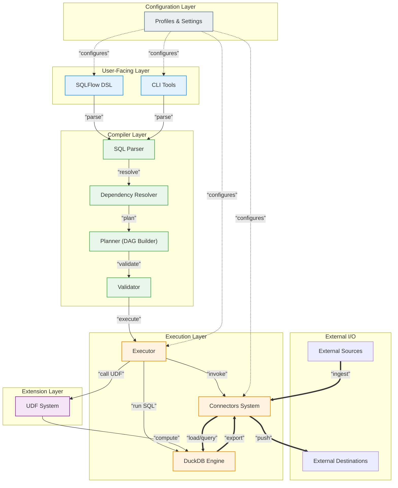

# SQLFlow: Conceptual Overview and Architecture

This document provides a high-level overview of SQLFlow's architecture, design principles, and how the various components work together to create a seamless data pipeline experience.

## Table of Contents

1. [Core Philosophy](#core-philosophy)
2. [Architecture Overview](#architecture-overview)
3. [Component Breakdown](#component-breakdown)
   - [Parser](#parser)
   - [Planner](#planner)
   - [Executor](#executor)
   - [Connectors](#connectors)
   - [UDF System](#udf-system)
4. [Data Flow](#data-flow)
5. [Profile System](#profile-system)
6. [Extension Points](#extension-points)
7. [Design Principles](#design-principles)

## Core Philosophy

SQLFlow is built on a few fundamental principles:

- **SQL-First**: Leverage the lingua franca of data that most practitioners already know
- **End-to-End**: Unite the full data pipeline lifecycle in a single tool
- **Simplicity**: Make complex data workflows accessible without sacrificing power
- **Extensibility**: Allow customization where needed while providing sane defaults

At its heart, SQLFlow aims to solve the fragmentation problem in the modern data stack by providing a unified language for defining, orchestrating and managing data pipelines, while still allowing for extension through Python when needed.

## Architecture Overview

SQLFlow follows a modular architecture with clear separation of concerns between different components:




The architecture highlights DuckDB Engine as the central component of SQLFlow's operation, with components organized into logical layers:

1. **User-Facing Layer**
   - **SQLFlow DSL**: Extended SQL syntax for defining pipelines
   - **CLI Tools**: Command-line interfaces for user interaction

2. **Compiler Layer**
   - **SQL Parser**: Converts DSL into structured internal representation
   - **Dependency Resolution**: Identifies relationships between operations
   - **Planner**: Creates the execution plan (DAG)
   - **Validator**: Ensures pipeline consistency and correctness

3. **Execution Layer**
   - **DuckDB Engine**: Core execution engine for all SQL operations (highlighted component)
   - **Executor**: Orchestrates the execution process
   - **UDF System**: Python-based custom functions for extending SQL capabilities
   - **Connectors System**: Standardized interfaces to data sources and destinations

4. **Configuration Layer**
   - **Profile System**: Manages environment-specific settings

This layered architecture follows traditional software architecture patterns while emphasizing DuckDB's central role in the system. Data flows from User-Facing through Compiler to Execution layers, all configured by the Configuration layer.

## Component Breakdown

### Parser

The parser is responsible for:

- Reading SQLFlow pipeline files (`.sf`)
- Tokenizing and parsing the custom SQLFlow syntax
- Validating syntax correctness
- Converting the code into an intermediate representation
- Resolving variable interpolation (e.g., `${variable_name}`)
- Processing conditional blocks (IF-THEN-ELSE)

Location: `sqlflow/parser/`

### Planner

The planner takes the parsed representation and:

- Builds a directed acyclic graph (DAG) of operations
- Resolves dependencies between operations
- Validates the logical consistency of the pipeline
- Optimizes the execution plan for efficiency
- Creates a serializable plan that the executor can process

Location: `sqlflow/core/planner.py`

### Executor

The executor is responsible for:

- Running the pipeline according to the execution plan
- Managing data movement between operations
- Handling errors and providing meaningful feedback
- Logging execution progress
- Coordinating the DuckDB engine for SQL execution
- Invoking connectors for data ingestion and export

Location: `sqlflow/core/executors.py`

### Connectors

The connector system:

- Provides a consistent interface for data sources and destinations
- Handles authentication and connection management
- Implements data reading and writing operations
- Manages schema inference and validation
- Supports different connector types (CSV, PostgreSQL, S3, etc.)

Each connector implements a standardized interface that allows SQLFlow to interact with various data systems consistently.

Location: `sqlflow/connectors/`

The DuckDB engine was chosen for SQLFlow because of its remarkable speed, embedded nature, support for both in-memory and persistent modes, and rich SQL functionality comparable to full-featured data warehouses.

Location: `sqlflow/core/engines/duckdb_engine.py`

### UDF System

The User-Defined Functions (UDF) system is central to SQLFlow's extensibility:

- Allows extending SQLFlow with custom Python functions
- Provides decorators for scalar and table functions
- Manages function discovery and registration
- Handles marshaling data between SQLFlow and Python
- Validates type safety and parameter correctness
- Seamlessly integrates with DuckDB for efficient execution

Location: `sqlflow/udfs/`

## Data Flow

A typical data flow in SQLFlow follows these steps:

1. **SOURCE**: Define external data sources
2. **LOAD**: Load data from sources into the SQLFlow workspace (DuckDB)
3. **CREATE TABLE**: Transform data with SQL operations
4. **EXPORT**: Send results to external destinations

Each step is executed by the corresponding component, with data flowing through the system as follows:

```
External Sources ──► Connectors ──► DuckDB ──► SQL Transforms ──► DuckDB ──► Connectors ──► External Destinations
                      (Read)         (Tables)     (Queries)        (Results)    (Write)
```

Throughout this process, Python UDFs may be invoked to perform custom operations that are difficult to express in pure SQL.

## Profile System

The profile system is SQLFlow's approach to environment management:

- **Profiles** are YAML files in the `profiles/` directory
- Each profile defines environment-specific settings:
  - Engine configuration (memory/persistent mode)
  - Connector parameters
  - Default variables
  - Logging settings

The profile system allows the same pipelines to run in different environments (dev, test, prod) with minimal configuration changes.

Location: `sqlflow/project.py`

## Extension Points

SQLFlow is designed to be extensible in several ways:

1. **Custom Connectors**: New connector types can be implemented by extending the base connector classes
2. **Python UDFs**: Both scalar and table-based functions can be added through the UDF system
3. **SQL Extensions**: The DuckDB engine supports custom SQL functions and extensions
4. **Visualization**: The DAG visualization can be customized or extended

## Design Principles

SQLFlow's architecture adheres to several key design principles:

### 1. Separation of Concerns

Each component has a clearly defined responsibility, making the system easier to understand, test, and extend.

### 2. Convention over Configuration

SQLFlow follows sensible defaults while allowing customization where needed, minimizing the need for boilerplate configuration.

### 3. SQL-First Approach

SQL remains the primary paradigm, with extensions only where necessary to manage pipeline flow.

### 4. Fail Fast and Explicit

Errors are detected early in the pipeline lifecycle (parsing, planning) before execution when possible, with clear error messages.

### 5. Progressive Disclosure

Basic functionality is simple to use, while advanced features are available but don't complicate the basic use cases.

### 6. Local-First Development

SQLFlow is designed to work locally first, with the ability to scale to more complex environments as needed.

### 7. Deterministic Execution

Given the same inputs and configuration, SQLFlow produces the same outputs, making pipelines reproducible and testable.

### 8. Explicit Dependencies

Dependencies between operations are explicit in the SQL code, making pipelines easier to understand and maintain.

## Conclusion

SQLFlow's architecture is designed to provide a seamless, SQL-centric experience for data pipelines while maintaining flexibility and extensibility. By adhering to clear design principles and a modular structure, SQLFlow aims to simplify the data engineering process without sacrificing power or capability.
